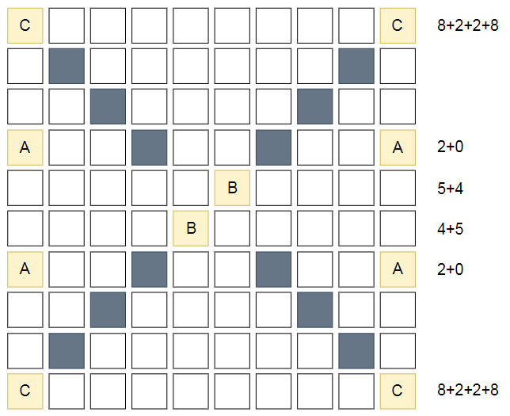

https://blog.yena.io/studynote/2018/11/14/Algorithm-Basic.html

# 문제 풀이

## 1. 로봇 이동거리

Abc 로봇회사는 직진만 할 수 있는 로봇을 만들었다. A 로봇은 오른쪽으로만 갈 수 있고, B 로봇은 좌우로 갈 수 있으며, C 로봇은 상하좌우로 이동 가능하다. 

### 각 로봇들이 갈 수 있는 거리를 구하세요. 

N*N의 네모 칸들로 이루어진 공간이 있고, 각 공간은 비어있거나 벽으로 되어 있다. 벽이 있는 공간을 만나면 로봇들은 더 이상 이동하지 못한다. 다른 로봇이 있던 초기 위치를 넘어가지 못한다고 가정한다.



1. 입력을 받은 값으로 2차원 배열을 새로 형성한다.
2. 초기에 설정해놓은 벽들의 위치와 로봇들의 초기 위치는 로봇들이 통과할 수 없는 지역이므로 빈 공간이 아니다.
3. 초기에 설정된 공간 밖은 이동할 수 없는 구간이므로 문제 풀이의 편의성을 위해서 공간 가장 바깥쪽에 벽으로 구성된  행과 열을 추가하여 새로운 행렬을 생성한다.

  - 사이즈는 (N+2) * (N+2)가 될 것이다.
4. 이제 이 행렬의 각 요소에 실행할 이동거리 계산 함수를 생성한다.

   for 문(행 진행) 안에 for 문(열 진행)을 사용해보자.

   - 함수는 제일 먼저 현재의 배열 요소가 S나 W인지 확인해주도록 하자. 움직일 수 있는 로봇들의 개수보다 나머지 빈 공간과 벽의 개수의 합이 훨씬 많기 때문이다.

     - true 인 경우 continue를 실행해준다.

     - false 인 경우 로봇의 종류에 따른 함수를 실행해준다.

       A : 우측으로밖에 이동할 수 없으므로 현재 위치 [x,y] 에서 열의 값인 y값에 대한 함수를 만들어준다. 

       B : 좌 우로밖에 이동할 수 없으므로 A와 마찬가지의 방법으로 좌, 우에 대한 이동거리 계산을 해준다.

       C : 상 하 좌 우로 이동할 수 있지만 예제를 살펴본 결과 도중에 방향을 바꾸진 못한다.

       거리를 계산하는 방법은 2가지로 나누어보았다.

       1. 로봇이 벽이나 다른 로봇의 초기 위치에 닿기 전 한칸 씩 움직일 때 마다 이동거리를 1 씩 늘려주는 방법
       2. 로봇이 벽이나 다른 로봇의 초기 위치에 다다랐을 때 벽의 위치를 이용하여 이동거리를 한번에 계산하는 방법

       이렇게 계산한 각각의 이동 거리를 결과 변수에 누적시켜준다.

### 전체 코드

```js
let arr = [3, 6, [['S', 'A', 'S', 'S', 'W', 'S'], ['S', 'W', 'A', 'S', 'C', 'S'], ['S', 'W', 'S', 'W', 'S', 'S'], ['S', 'W', 'S', 'S', 'W', 'S'], ['S', 'B', 'S', 'S', 'W', 'S'], ['S', 'S', 'S', 'S', 'S', 'S']], 3, [['S', 'S', 'A'], ['B', 'W', 'W'], ['S', 'W', 'C']], 10, [['C', 'S', 'S', 'S', 'S', 'S', 'S', 'S', 'S', 'C'], ['S', 'W', 'S', 'S', 'S', 'S', 'S', 'S', 'W', 'S'], ['S', 'S', 'W', 'S', 'S', 'S', 'S', 'W', 'S', 'S'], ['A', 'S', 'S', 'W', 'S', 'S', 'W', 'S', 'S', 'A'], ['S', 'S', 'S', 'S', 'S', 'B', 'S', 'S', 'S', 'S'], ['S', 'S', 'S', 'S', 'B', 'S', 'S', 'S', 'S', 'S'], ['A', 'S', 'S', 'W', 'S', 'S', 'W', 'S', 'S', 'A'], ['S', 'S', 'W', 'S', 'S', 'S', 'S', 'W', 'S', 'S'], ['S', 'W', 'S', 'S', 'S', 'S', 'S', 'S', 'W', 'S'], ['C', 'S', 'S', 'S', 'S', 'S', 'S', 'S', 'S', 'C']]];

let distance = (arr) => {
    let index = 0;
    let answer = [];
    while (index <= arr.length) {
        if(typeof arr[index]!=='object') {
            index++;
            continue;
        }
        let padding = [];
        let stack = 0;
        for (let i = 0; i < arr[index].length; i++) {
            // arr[index][i] = ['W'].concat(arr[index][i].concat(['W']));
            arr[index][i].push('W');
            arr[index][i].unshift('W');
        }
        for (let i = 0; i < arr[index].length + 2; i++) {
            padding.push('W');
        }
        console.log(padding);
        // arr[index] = [padding].concat(arr[index].concat([padding]));
        arr[index].push(padding);
        arr[index].unshift(padding);
        console.log(arr[index]);
        for (let i = 0; i < arr[index].length; i++) {
            for (let j = 0; j < arr[index].length; j++) {
                if (arr[index][i][j] === 'W' || arr[index][i][j] === 'S') continue;
                else if (arr[index][i][j] === 'A') {
                    let k = 1;
                    while (1) {
                        if (arr[index][i][j + k] === 'S') k++;
                        else {
                            k--;
                            stack += k;
                            break;
                        }
                    }
                }
                else if (arr[index][i][j] === 'B') {
                    let k = 1;
                    while (1) {
                        if (arr[index][i][j + k] === 'S') k++;
                        else {
                            k--;
                            stack += k;
                            k = 1;
                            break;
                        }
                    }
                    while (1) {
                        if (arr[index][i][j - k] === 'S') k++;
                        else {
                            k--;
                            stack += k;
                            k = 1;
                            break;
                        }
                    }
                }
                else {
                    let k = 1;
                    while (1) {
                        if (arr[index][i][j + k] === 'S') k++;
                        else {
                            k--;
                            stack += k;
                            k = 1;
                            break;
                        }
                    }
                    while (1) {
                        if (arr[index][i][j - k] === 'S') k++;
                        else {
                            k--;
                            stack += k;
                            k = 1;
                            break;
                        }
                    }
                    while (1) {
                        if (arr[index][i + k][j] === 'S') k++;
                        else {
                            k--;
                            stack += k;
                            k = 1;
                            break;
                        }
                    }
                    while (1) {
                        if (arr[index][i - k][j] === 'S') k++;
                        else {
                            k--;
                            stack += k;
                            k = 1;
                            break;
                        }
                    }
                }
            }
        }
        answer.push(stack);
        index++;
    }
    for(let i=0; i<answer.length; i++){
        console.log(`#${i+1} ${answer[i]}`);
    }
}
distance(arr);
```

