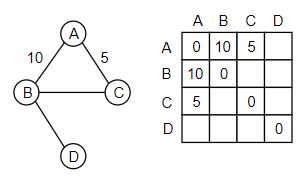
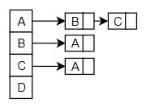
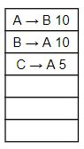

## 삼성 알고리즘 SW 검정
IM - 논리적인가? 기본적인 난이도
AD - 알고리즘(8개의 원리 응용해서 문제를 풀 수 있는가?)
한문제 정답 AD, 두문제 정답 AD+
PRO - 문제를 '최적화'를 잘 해서 풀었는가?
EXPERT -

알고리즘 Site (시작은 정을부터 하느넥 좋을 것)
- 삼성 : https://swexpertacademy.com/main/main.do 에서 code-problem 에서 문제풀기 가능 (Difficulty 1,2번은 알고리즘 학습없이 풀이 가능 - 언어는 알아야함 ^^)
	나중에 우측 상단에 상시 SW 역량테스트 접수하기(AD부터 있음 AD-A형, PRO-B형)
- 백준 : https://www.acmicpc.net/
- 정을 : jungol.co.kr
	- 단계별
	  1. 기초 다지기 1 ~ 4 한문제씩, 5 ~ 9 : 3문제씩, 10 : 자가진단 전부 풀기
	  2. 배포 문제
	  3. 실력 키우기 - 도형 : 3문제씩, 수학: 잘하면 풀고, 문자열, 여러가지 : 다 풀어보자.

##### 3일날 강사님 수업
자료구조
알고리즘


## 역사

46~70 : 연구소 학교에서 미사일이 어디 떨어질까 계산하는데 컴퓨터 사용 0,1(기계어)로 짬

→ 어셈블리어(0과 1을 기호화시킨 것) 아직도 C 언어 아래에 사용중

70 : 어셈블리어도 너무 어렵다. - **C**, PASCAL 등장

80 : 기업에 컴퓨터 들어감 - COBOL(거의 코볼로 기업의 시스템을 전산화했다.) / PLI

90 : WEB의 부상

- PC시대 - 가구마다 컴퓨터가 들어감 - 대량 생산 - 가격 ↓ 품질 ↑
- 객체지향(PC나 자동차뿐 아니라 SW또한 부품처럼 조립해서 만들자) - C++, JAVA, C#(MS)

90~2010 : JAVA로 거의 모든 서비스(50%이상)가 만들어짐.

- FRONT-END

- BACK-END

  대기업

  - Servlet/JSP  - Spring
  - MS : .NET

  중소기업

  - php 에서
  - python 으로
  - javascript 로

2013 쯤 : 

- IoT(스마트폰의 대중화) 등이 떠오르면서 사물에 올릴 서버로 JAVA는 너무 무거웠다.
- 그러면 앞으로의 대세는 무엇일까? 가벼운 javascript(node.js) 라는 생각이 떠올랐다.

2015 부터 :

- BIG DATA / AI 가 떠오르면서(IoT의 영향이 크다) PYTHON이 대세가 될거라는 의견이 많이 생겼다.
- PYTHON(IoT, 빅데이터, AI, 기업용 웹시장)
- 앞으로의 가능성? GO LANG(구글) - PYTHON의 속도 부분을 개선한 언어


JAVA는 객체지향인데 객체는 어떻게 만들 것인가?

객체

- 서로 식별할 수 있는 data와 기능을 가지고있다.
- data와 기능의 집합

```java
/* 객체에 대한 설계를 class로 한다. name, 설계 처음 공부는 js, python처럼 스크립트 언어가 쉽지만, 큰 프로그램을 만들때는 스크립트형 언어는 필요한 기능을 모두 공부해야 하지만 자바는 문법을 공부하면 만들기 편하다. */
// 기능 : js 에선 함수, java에선 method
class 학생 {
    // 변수(Variable)
    // 자바문장 1. 선언문 - type 변수명( = 값;) (자바는 선언이 먼저 선행되지 않으면 사용할 수 없다.)
    String name; // 문자열 - 문자들이 여러개 오는 것
    int age; // 정수
    // 기능(method = 함수) 함수에 들어가는 변수들 - arguments(전달인자) or parameters(매개변수)
    public void study(int time){
        /* 공부 방법을 기술
        time 만큼 공부를 어떻게 할 것인지.
        사람이 하는 일을 대신 해준다.
        1. 순차적으로 하는 일 (순차 구조)
        - 자바 문장 2. 대입문 -> a = x; b = y;
        2. A의 결과에 따라 다시 A를 하거나 B나 다른 일로 넘어가는 일 (조건 구조)
        3. A 다음 B를 여러번 할 수도 있다. (반복 구조) 
        자바 문장 3. 조건문 - if(조건) { 집합 } else { ... }
        자바 문장 4. 반복문 - for(반복구간){ ... }*/   
    }
}
```


### 이클립스 사용

1. new java project
2. 수많은 class 들을 정리하기 위해 폴더처럼 package를 사용해서 정리한다.
   - 삼성은 com.samsung으로 시작
   - com.android 는 모든 android가 사용 가능 - 구글이 만든거라 사용할 때 돈내라하면 내야함
   - package와 class를 구분하기 위해 class는 대문자로 시작을 한다.
   - main은 내가 부르지 않아도 자동으로 실행시키는 옵션

FileInputStream("a.txt") 에서 a.txt 는 프로젝트 바로 아래에 있어야 한다.

}


10/5 1시에 와서 발표 준비

10/6 11시에 와서 시강(나눠준 2문제 + 받았던 문제들 중 하나 선택, 듣는 사람이 전혀 모른다는 가정하에 시강이 진행될 것 - 개략, 상세, 그림, 슈더 코드(이런식으로 짜면 됩니다~))


11/16 AD SW 검정시험 준비


# 시험

자료구조를 직접 만들 필요는 없지만 사용할 줄은 알아야 한다. list set 등등

컬렉션이 편하긴 하지만 배열보다 느리기 때문에, 배열로 풀 수 있으면 컬렉션을 최소화하고 배열을 쓰는게 좋다.

A형 까지는 api 사용을 금지하진 않음


공간 복잡도

- 메모리
  - 입력 크기 확인(컬렉션은 원하는 만큼 가변적으로 조절할 수 있지만, 배열은 다 사용하지 못하게 만드는 경우가 많다.)
  - 테스트 케이스마다 배열을 새로 생성하는 경우 메모리가 오버플로우될 수 있다 → 테스트 케이스 반복문 밖에 사이즈가 충분히 큰 사용할 배열을 선언해놓고 반복문 안에서는 그 배열의 사이즈를 부분만 사용하는 방식으로 사용한다.

시간 복잡도

- 수행 시간


1. 1차원 배열, 2차원 배열, 3차원 배열
   - 회전, 밀기(shift), 규칙 찾기
2. Collection - List, Set(HashSet), Map(HashMap)
   - Comparator → 비교 방식
     - Arrays.sort(arr, **여기 들어감**)
     - Collections.sort()
   - Comparable


List

- ArrayList

- Stack

- Queue

  - LinkedList

- PriorityQueue = API는 Heap으로 구현되어있음

  값이 입력될 때 알아서 정렬되기 때문에 최소값, 최대값을 찾을 때는 루트 노드를 빼서 쓴다. 정렬 될 때 2진트리 구조이기 때문에 logN 효율을 가져서 좋다.

  - 최소 Heap
    - 부모 노드 값 <= 자식 노드 값
    - 루트 노드가 최소값을 가진다.
  - 최대 Heap
    - 부모 노드 값 >= 자식 노드 값
    - 루트 노드가 최대값을 가진다.


비선형 잘구조

- Tree

  - 배열을 사용한 구현

    - 자식 노드 개수가 확실치 않기 때문에 애매한 경우가 있을 수 있다.

    - 자식 노드가 한정된 트리는 배열이 좋다.(2진트리 같은)

    - 배열에는 트리의 index를 사용해서 집어넣는다.(2진트리 등 자식 노드 개수가 고정된 트리의 규칙성을 이용)

    - 다만 한쪽 방향으로 편향된 트리의 경우 낭비되는 공간이 많아진다.

      

  - 연결리스트를 사용한 구현

- Graph

  - 인접 행렬

    인접 노드에 대한 정보를 모든 노드를 표현한 행렬에 표현한다.

    

  - 인접 리스트

    인접 노드에 대한 정보만 연결 리스트 형태로 넣어준다.(노드의 수가 많아질 수록 효율적)

    

    인접 노드를 추가 해주는 경우 앞쪽에만 대입해주는 방식으로 구현하면 편하다.

    추가해주는 노드의 포인터를 해당 노드에 추가해주고 원래 있던 노드의 포인터를 새로 추가해준 노드에 넣어준다.

  - 간선 리스트

    출발점, 목적지, 가중치를 저장하는 커스텀 객체를 만들어서 저장한다.

    


알고리즘 유형

1. 완전탐색(브루트포스) → 시간복잡도

   ★★★★★★★★★★

   - 부분집합
   
     bit masking
   
     1	2	3	의 부분집합
   
     2의 3승 8가지
   
     0~7을 각각 부분집합으로 생각하고 사용
   
     | 0    | 000 = {}        |
     | ---- | --------------- |
     | 1    | 001 = {1}       |
     | 2    | 010 = {2}       |
     | 3    | 011 = {1, 2}    |
     | 4    | 100 = {3}       |
     | 5    | 101 = {1, 3}    |
     | 6    | 110 = {2, 3}    |
     | 7    | 111 = {1, 2, 3} |
   
     비트 연산자를 알아야함 ( AND, OR, SHIFT)
   
     1 << 0	1을 0번 왼쪽 쉬프팅
   
     1 << 1	1을 1번 왼쪽 쉬프팅
   
     1 << 2	1을 2번 왼쪽 쉬프팅
   
     ​		0	1	1
   
     &	 0	0	1
   
     ​		0	0	1	> 0 이면 비트가 존재한다 판단
   
     쉬프팅을 사용하여 AND 비교할 비트를 정할수도 있음
   
     ​		0	0	0
   
     |	  0	1	0
   
     ​		0	1	0
   
     비트 마스킹의 경우 객체와는 다르게 primative 타입이라 연산 후에 원래대로 돌려줄 필요가 없다.
   
   - 순열
     
     - n개 => nPn, nPr
     - nextPermutation 힘들면 이거 외우는게 쉬울수도

   

1 2 3의 순열을 구해라

```java
p(int index){ // index는 순열 자리
    for(int i=index; i<n; ++i){
        swap(index,i);
        p(index+1);
        swap(index,i);
    }
}
/*
1	2	3	123
1	3	2	132
2	1	3	213
2	3	1	231
3	2	1	321
3	1	2	312
*/
```

   - 조합 nCr

     4C2	1 2 3 4

     시작점은 4개가 될 수 있다.

     1

     - 2	12
     - 3    13
     - 4    14

     2

     - 3	23
     - 4    24

     3

     - 4	34

     4

     ```java
     c(int index, int cnt)
         for(int i-index; i<N; i++){
             ans[cnt] = n[i];
             c(i+1, cnt+1);
         }
     ```

     

   ★★★★★★★★★★

2. 백 트래킹

   기본은 완전탐색이지만, 탐색할 필요가 없는 부분을 쳐내는 가지치기를 통해 개선함.

3. 탐욕 기법(Greedy)

4. 분할 정복

5. Dynamic Programming

   - 점화식을 이용한 문제 해결


문제 풀 때 우선해야 할 것

1. I/O 속도 개선

   - Input: BufferedReader 사용 - String tokenizer
   - Output: StringBuilder

2. List<Person> list 사용 시

   list.get(i).name, list.get(i).age 같이 사용하면 매번 찾는 시간이 걸리기 때문에 대신

   Person p = list.get(i); p.name, p.age 같이 변수에 캐시 해놓고 사용하자.

3. 초기화 코드

   for(int i=1; i<max; ++i){

   ​	// 초기화를 바깥 말고 안쪽에 넣자. 최소값 초기화의 경우 바깥쪽에 해놓으면 최소값이 앞의 루프에서 바뀐 경우 다음 루프에서 바뀐 최소값을 사용하기 때문에 오류가 날 수 있다.

   }

4. 데이터 타입 체크