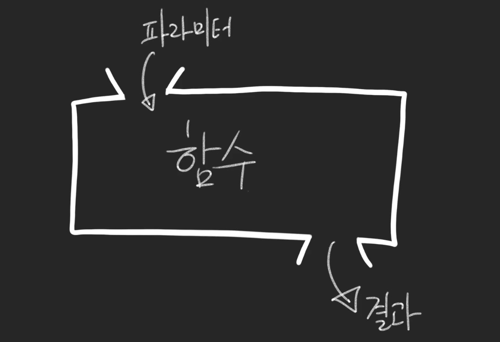

# Javascript

웹 브라우저에서 사용하기 위하여 만들어진 프로그래밍 언어

90년대부터 주로 웹 브라우저 상에서 UI 를 동적으로 보여주기 위하여 사용

이제는 단순히 웹페이지에서만 국한되지 않고 Node.js 런타임을 통하여 서버 쪽에서도 사용을 할 수 있게 됐다.

### 코드 작성 결과 확인

- [https://codesandbox.io](https://codesandbox.io/)
- Vanilla - 다른 라이브러리 없이 자바 스크립트만 사용


### 변수

#### let

- 바뀔 수 있는 값

- 한번 값을 선언하고 나서 바꿀 수 있다.

  ```js
  let value = 1;
  console.log(value);
  value = 2;
  console.log(value);
  ```

#### var

- 옛날 방식
- 똑같은 이름으로 여러 번 선언 가능
- var 과 let 은 사용 할 수 있는 범위가 다름
- IE9, IE10 같은 구형 브라우저에서는 let 과 const 를 사용 할 수 없다. 하지만, 보통 개발을 하게 될 때는 Babel 과 같은 도구를 사용하여 코드가 구형 브라우저에서도 돌아갈 수 있게 끔 변환 작업을 함

### 상수

- 한번 선언하고 값이 바뀌지 않는 값

  ```js
  const a = 1;
  a = 2; // 불가능 "Error: "a" is read-only"
  
  const a = 1;
  const a = 2; // 불가능 이미 선언됨
  
  ```

  

### 데이터 타입

1. 숫자(Number)

   ```js
   let value = 1;
   ```

2. 문자열(String)

   ```js
   let text = 'hello';
   let name = '좌봐스크립트';
   ```

3. 참/거짓 (Boolean)

   참 혹은 거짓 두 가지 종류의 값 만을 나타낼 수 있다

   ```js
   let good = true;
   let loading = false;
   ```

4. null 과 undefined - "없음"을 의미

   차이점

   - null 은 주로 이 값이 없다 라고 선언을 할 때 사용

   - 없다고 고의적으로 설정하는 값

     ```js
     const friend = null;
     ```

   - undefined 는 아직 값이 설정되지 않은 것을 의미

   - 설정을 하지 않았기 때문에 없는 값

     ```js
     let criminal;
     console.log(criminal);
     ```


## 연산자

#### 산술 연산자

사칙 연산과 같은 작업을 하는 연산자를 의미

- `-`: 뺄셈

- `*`: 곱셈

- `/`: 나눗셈

  ```js
  let a = 1 + 2 - (3 * 4) / 4;
  console.log(a);
  
  let a = 1;
  a++;
  ++a;
  console.log(a);
  // console.log(a++); 를 할 때에는 1을 더하기 직전 값을 보여주고 console.log(++a); 를 할 때에는 1을 더한 다음의 값을 보여줌
  a--;
  console.log(a);
  ```

#### 대입 연산자

특정 값에 연산을 한 값을 바로 설정 할 때 사용 할 수 있는 연산자

```js
let a = 1;
a += 3;
a -= 3;
a *= 3;
a /= 3;
console.log(a);
```

#### 논리 연산자

Boolean 타입(true 혹은 false)을 위한 연산자

총 3 가지가 있다.

- `!`: NOT
- `&&`: AND
- `||`: OR

1. NOT

   true 는 false 로, false 는 true 로 바꿔줌

   ```js
   const a = !true;
   console.log(a); // false
   const b = !false;
   console.log(b); // true
   ```

2. AND

   양쪽의 값이 둘 다 true 일 때만 결과물이 true

   ```js
   const a = true && true;
   console.log(a); // true
   ```

3. OR

   양쪽의 값 중 하나라도 true 라면 결과물이 true

   ```js
   let t = true || false;
   t = false || true;
   t = true || true;
   // true
   ```

#### 연산 순서

순서는 NOT -> AND -> OR

```js
const value = !((true && false) || (true && false) || !false);
```

#### 비교 연산자

비교 연산자는 두 값을 비교 할 때 사용 할 수 있다

#### 두 값이 일치하는지 확인

`===` 는 두 값이 일치하는지 확인해줌 

일치한다면 true, 일치하지 않는다면 false

`=` 문자 2개로도 비교를 할 수는 있다.

```javascript
const a = 1;
const b = 1;
const equals = a == b;
console.log(equals);
```

2개 있을 때에는 타입 검사까지는 하지 않는다는 것입니다.

예를 들어서 `==` 를 사용하면 숫자 1과 문자 '1' 이 동일한 값으로 간주

```javascript
const a = 1;
const b = '1';
const equals = a == b;
console.log(equals); // true
```

그리고, 0 과 false 도 같은 값으로 간주

```javascript
const a = 0;
const b = false;
const equals = a == b;
console.log(equals); // true
```

그리고 undefined 와 null 도 같은 값으로 간주

`==` 를 사용하다보면 실수를 할 확률이 높아짐

#### 두 값이 일치하지 않는지 확인

두 값이 일치하지 않는지 확인 할 때에는 `!==` 를 사용

```javascript
const value = 'a' !== 'b'; // true
```

`!=` 를 사용하게 되면 타입 검사를 하지 않음

```javascript
console.log(1 != '1'); // false
console.log(1 !== '1'); // true
```

 !== 를 사용 할 것을 권장

#### 크고 작음

두 값 중에서 무엇이 더 크고 작은지 비교하기 위해서는 다음 연산자를 사용

```js
const a = 10;
const b = 15;
const c = 15;

console.log(a < b); // true
console.log(b > a); // true
console.log(b >= c); // true
console.log(a <= c); // true
console.log(b < c); // false
```

#### 문자열 붙이기

두 문자열을 붙일 때에는 `+` 로

```javascript
const a = '안녕';
const b = '하세요';
console.log(a + b); // 안녕하세요
```


## 조건문

특정 조건이 만족됐을 때 특정 코드를 실행

### if 문

가장 기본적  "~~하다면 ~~를 해라"

```js
const a = 1;
if (a + 1 === 2) {
  console.log('a + 1 이 2 입니다.');
}
```

### if-else 문

if-else문은 "~~하다면 ~~하고, 그렇지 않다면 ~~해라."

```js
const a = 10;
if (a > 15) {
  console.log('a 가 15 큽니다.');
} else {
  console.log('a 가 15보다 크지 않습니다.');
}
```

### if-else if 문

if-else if 문은 여러 조건에 따라 다른 작업을 해야 할 때 사용

```js
const a = 10;
if (a === 5) {
  console.log('5입니다!');
} else if (a === 10) {
  console.log('10입니다!');
} else {
  console.log('5도 아니고 10도 아닙니다.');
}
```

### switch/case 문

switch/case 문은 특정 값이 무엇이냐 에 따라 다른 작업을 하고 싶을 때 사용

```js
const device = 'iphone';

switch (device) {
  case 'iphone':
    console.log('아이폰!');
    break;
  case 'ipad':
    console.log('아이패드!');
    break;
  case 'galaxy note':
    console.log('갤럭시 노트!');
    break;
  default:
    console.log('모르겠네요..');
}
```

## 함수 ★

함수는, 특정 코드를 하나의 명령으로 실행



함수를 만들 때는 `function` 키워드를 사용하며, 함수에서 어떤 값을 받아올지 정해 주는데 이를 파라미터(매개변수)라고 부름

함수 내부에서 `return` 키워드를 사용하여 함수의 결과물을 지정 할 수 있다

`return` 을 하게 되면 함수가 끝난다. 만약 다음과 같이 코드가 작성된다면, return 아래의 코드는 호출이 안됨

```js
function add(a, b) {
  return a + b;
  console.log('호출이 되지 않는 코드!');
}

const sum = add(1, 2);
console.log(sum); // 3

function hello(name) {
  console.log('Hello, ' + name + '!');
}
hello('velopert'); // "Hello, velopert!"
```

문자열 조합을 더욱 편하게 하는 방법이 - ES6 의 템플릿 리터럴 (Template Literal)이라는 문법을 사용

> **ES6 가 뭔가요?**
>
> ES6 는 ECMAScript6 를 의미하며, 자바스크립트의 버전을 가리킵니다. ES6는 2015년에 도입이 되었습니다. ES6 는 ES2015 라고 불리기도 합니다. 그리고 2015년 이후에 계속해서 새로운 자바스크립트 버전이 나오고 있습니다. ES7(ES2016) ES8(ES2017) ES9(ES2018) ES10(ES2019).. 새로운 자바스크립트 버전이 나올때마다 새로운 문법이 소개됩니다.
>
> 브라우저 버전에 따라 지원되는 자바스크립트 버전이 다릅니다. 하지만, 보통 웹 개발을 할 때에는 Babel 이라는 도구를 사용하여 최신 버전의 자바스크립트가 구버전의 브라우저에서도 실행되도록 할 수 있습니다. (정확히는, 최신버전 자바스크립트를 구버전 형태로 변환하는 작업을 거칩니다.)

```js
function hello(name) {
  console.log(`Hello, ${name}!`);
}
hello('velopert');
```

### 화살표 함수

함수를 선언하는 방식 중 또 다른 방법은 화살표 함수 문법을 사용 하는 것

```js
// 좌측에는 함수의 파라미터, 화살표의 우측에는 코드 블록
const add = (a, b) => {
  return a + b;
};

console.log(add(1, 2));

// 코드 블록 내부에서 바로 return 을 하는 경우는 다음과 같이 줄여서 쓸 수도 있다
const add = (a, b) => a + b;
console.log(add(1, 2));
```

### 화살표 함수와 일반 function 으로 만든 함수와의 주요 차이점

- 화살표 함수에서 가리키는 this 와 function 에서 가리키는 this 가 서로 다르다


## 객체

변수 혹은 상수를 사용하게 될 때 하나의 이름에 여러 종류의 값을 넣을 수 있게 해줌

```js
const dog = {
  name: '멍멍이',
  age: 2
};

console.log(dog.name);
console.log(dog.age);
```

객체를 선언 할 때에는 이렇게 `{ }` 문자 안에 원하는 값들을 넣어주면 된다. 값을 집어 넣을 때에는

```
키: 원하는 값
```

형태로 넣으며, 키에 해당하는 부분은 공백이 없어야 한다. 만약에 공백이 있어야 하는 상황이라면 이를 따옴표로 감싸서 문자열로 넣어주면 됨

```javascript
const sample = {
  'key with space': true
};
```

### 함수에서 객체를 파라미터로 받기

```js
const ironMan = {
  name: '토니 스타크',
  actor: '로버트 다우니 주니어',
  alias: '아이언맨'
};

const captainAmerica = {
  name: '스티븐 로저스',
  actor: '크리스 에반스',
  alias: '캡틴 아메리카'
};

function print(hero) {
  const text = `${hero.alias}(${hero.name}) 역할을 맡은 배우는 ${
    hero.actor
  } 입니다.`;
  console.log(text);
}

print(ironMan);
print(captainAmerica);
// 아이언맨(토니 스타크) 역할을 맡은 배우는 로버트 다우니 주니어 입니다.
// 캡틴 아메리카(스티븐 로저스) 역할을 맡은 배우는 크리스 에반스 입니다.
```

### 객체 비 구조화 할당(ES6)

print 함수를 보시면 파라미터로 받아온 hero 내부의 값을 조회 할 때 마다 `hero.` 를 입력하고 있는데, 객체 비 구조화 할당이라는 문법을 사용하면 코드를 더욱 짧고 보기 좋게 작성 할 수 있다

>  이 문법은 "객체 구조 분해" 라고 불리기도 함

```js
function print(hero) {
  const { alias, name, actor } = hero; // 객체에서 값들을 추출해서 새로운 상수로 선언
  const text = `${alias}(${name}) 역할을 맡은 배우는 ${actor} 입니다.`;
  console.log(text);
}
```

여기서 더 나아가면, 파라미터 단계에서 객체 비구조화 할당을 할 수도 있다

```js
function print({ alias, name, actor }) {
  const text = `${alias}(${name}) 역할을 맡은 배우는 ${actor} 입니다.`;
  console.log(text);
}

print(ironMan);
print(captainAmerica);
```

### 객체 안에 함수 넣기

객체 안에 함수를 넣을 수도 있다

```js
const dog = {
  name: '멍멍이',
  sound: '멍멍!',
  say: function say() {
    console.log(this.sound);
  }
};

dog.say(); // 멍멍!
```

함수가 객체 안에 들어가게 되면, `this` 는 자신이 속해있는 객체를 가리키게 된다.

함수를 선언 할 때에는 이름이 없어도 됨

```js
const dog = {
  name: '멍멍이',
  sound: '멍멍!',
  say: function() {
    console.log(this.sound);
  }
};

dog.say(); // 멍멍!
```

객체 안에 함수를 넣을 때, 화살표 함수로 선언한다면 제대로 작동하지 않는다.

`TypeError: Cannot read property 'sound' of undefined`

이유는, function 으로 선언한 함수는 this 가 제대로 자신이 속한 객체를 가리키게 되는데, 화살표 함수는 그렇지 않기 때문

## Getter 함수와 Setter 함수

객체를 만들고 나면, 다음과 같이 객체 안의 값을 수정 할 수도 있음

```js
const numbers = {
  a: 1,
  b: 2
};

numbers.a = 5;
console.log(numbers);
```

Getter 함수와 Setter 함수를 사용하게 되면 특정 값을 바꾸려고 하거나, 특정 값을 조회하려고 할 때 우리가 원하는 코드를 실행 시킬 수 있다

```js
const numbers = {
  a: 1,
  b: 2,
  get sum() {
    console.log('sum 함수가 실행됩니다!');
    return this.a + this.b;
  }
};

console.log(numbers.sum);
numbers.b = 5;
console.log(numbers.sum);
```

우리는 `numbers.sum()` 을 한 것이 아니라 `number.sum` 을 조회했을 뿐인데, 함수가 실행되고 그 결과 값이 출력 되었다.

이런 식으로 Getter 함수는 특정 값을 조회 할 때 우리가 설정한 함수로 연산 된 값을 반환한다.

이번에는 Setter 함수를 사용해보자.

```js
const numbers = {
  _a: 1,
  _b: 2,
  sum: 3,
  calculate() {
    console.log('calculate');
    this.sum = this._a + this._b;
  },
  get a() {
    return this._a;
  },
  get b() {
    return this._b;
  },
  set a(value) {
    console.log('a가 바뀝니다.');
    this._a = value;
    this.calculate();
  },
  set b(value) {
    console.log('b가 바뀝니다.');
    this._b = value;
    this.calculate();
  }
};

console.log(numbers.sum);
numbers.a = 5;
numbers.b = 7;
numbers.a = 9;
console.log(numbers.sum);
console.log(numbers.sum);
console.log(numbers.sum);
```


## 배열

배열은 여러 개의 항목들이 들어있는 리스트

```js
const array = [1, 2, 3, 4, 5];
const objects = [{ name: '멍멍이' }, { name: '야옹이' }];

console.log(objects);
console.log(objects[0]);
console.log(objects[1]);
```

### 배열에 새 항목 추가하기

배열에 새로운 항목을 추가 할 때에는 배열이 지니고 있는 내장 함수인 `push` 함수를 사용

```javascript
const objects = [{ name: '멍멍이' }, { name: '야옹이' }];

objects.push({
  name: '멍뭉이'
});

console.log(objects);
```

### 배열의 크기 알아내기

배열의 크기를 알아낼 때에는 배열의 `length` 값을 확인

```javascript
const objects = [{ name: '멍멍이' }, { name: '야옹이' }];

console.log(objects.length);

objects.push({
  name: '멍뭉이'
});

console.log(objects.length);
```


## 반복문

### for

for 문은 가장 기본적인 반복문. 특정 값에 변화를 주어 가면서 우리가 정한 조건이 만족된다면 계속 반복한다.

```javascript
for (let i = 0; i < 10; i++) {
  console.log(i);
}
```

for 문을 다음과 같이 사용

```javascript
for (초기 구문; 조건 구문; 변화 구문;) {
  코드
}
```

for 문을 사용 할 때 보통 `i++` 를 해서 1씩 증감하는 형태로 사용

1씩 빼는 형태도 가능

```javascript
for (let i = 10; i > 0; i--) {
  console.log(i);
}
```

#### 배열과 for

배열과 for 문을 함께 활용

```javascript
const names = ['멍멍이', '야옹이', '멍뭉이'];

for (let i = 0; i < names.length; i++) {
  console.log(names[i]);
}
```

### while

while문은 특정 조건이 참이라면 계속해서 반복하는 반복문

for 문은 특정 숫자를 가지고 숫자의 값을 비교하고, 증감해주면서 반복을 한다면, while문은 조건을 확인만 하면서 반복을 한다. 때문에, 조건문 내부에서 변화를 직접 주어야 함

```javascript
let i = 0;
while (i < 10) {
  console.log(i);
  i++;
}
```

while 문을 사용 할 때에는 조건문이 언젠간 false 가 되도록 신경쓰자

### for...of

`for...of`문은 배열에 관한 반복문을 돌리기 위해서 만들어진 반복문

> 사실 이 구문은 배워놔도 사용 할 일이 별로 없다. 보통 배열을 반복할때에는 배열의 내장함수를 많이 사용

```javascript
let numbers = [10, 20, 30, 40, 50];
for (let number of numbers) {
  console.log(number);
}
```

### 객체를 위한 반복문 for...in

객체를 위한 반복문을 알아보기 전에, 객체의 정보를 배열 형태로 받아올 수 있는 함수 몇가지를 알아보자

```javascript
const doggy = {
  name: '멍멍이',
  sound: '멍멍',
  age: 2
};

console.log(Object.entries(doggy));
console.log(Object.keys(doggy));
console.log(Object.values(doggy));
```

각 함수의 역할

- `Object.entries`: `[[키, 값], [키, 값]]` 형태의 배열로 변환
- `Object.keys`: `[키, 키, 키]` 형태의 배열로 변환
- `Object.values`: `[값, 값, 값]` 형태의 배열로 변환

객체가 지니고 있는 값에 대하여 반복을 하고 싶다면 위 함수들을 사용하거나, `for...in` 구문을 사용

```javascript
const doggy = {
  name: '멍멍이',
  sound: '멍멍',
  age: 2
};

for (let key in doggy) {
  console.log(`${key}: ${doggy[key]}`);
}
```

### break 와 continue

반복문 안에서는 `break` 와 `continue` 를 통하여 반복문에서 벗어나거나, 그 다음 루프를 돌게 끔 할 수 있다

```javascript
for (let i = 0; i < 10; i++) {
  if (i === 2) continue; // 다음 루프를 실행
  console.log(i);
  if (i === 5) break; // 반복문을 끝내기
}
```

i 가 2 일 땐 `continue` 를 하여 원래 console.log 를 해야 하지만 그 코드를 수행하지 않고 바로 3으로 넘어감

i 가 5 일 땐 `break` 를 하여 반복문을 종료


## 배열 내장 함수

배열을 다룰 때 알고 있으면 너무나 유용한 다양한 내장 함수들에 대하여 알아보겠습니다.

### forEach

`forEach` 는 가장 쉬운 배열 내장 함수로 for 문을 대체 시킬 수 있다

```javascript
const superheroes = ['아이언맨', '캡틴 아메리카', '토르', '닥터 스트레인지'];
```

만약, 배열 안에 있는 모든 원소들을 모두 출력해야 한다면 for 문을 사용하여 다음과 같이 구현 할 수 있는데

```javascript
const superheroes = ['아이언맨', '캡틴 아메리카', '토르', '닥터 스트레인지'];

for (let i = 0; i < superheroes.length; i++) {
  console.log(superheroes[i]);
}
```

배열의 forEach 함수를 사용하면 다음과 같이 구현 할 수 있다.

```javascript
const superheroes = ['아이언맨', '캡틴 아메리카', '토르', '닥터 스트레인지'];

superheroes.forEach(hero => {
  console.log(hero);
});
```

forEach 함수의 파라미터로는, 각 원소에 대하여 처리하고 싶은 코드를 함수로 넣어줍니다. 이 함수의 파라미터 hero는 각 원소를 가르키게 됩니다.

이렇게 <u>**함수형태의 파라미터를 전달하는 것을 콜백함수 라고 부른다**</u>. 함수를 등록해주면, forEach 가 실행을 해줌

### map

`map` 은 배열 안의 각 원소를 변환 할 때 사용 되며, 이 과정에서 새로운 배열이 만들어짐

```javascript
const array = [1, 2, 3, 4, 5, 6, 7, 8];
```

만약에 배열 안의 모든 숫자를 제곱해서 새로운 배열을 만들고 싶다면 map 함수를 사용하지 않고 우리가 지금까지 배운 지식들을 활용하면 다음과 같이 구현 할 수 있다.

```javascript
const array = [1, 2, 3, 4, 5, 6, 7, 8];

const squared = [];
for (let i = 0; i < array.length; i++) {
  squared.push(array[i] * array[i]);
}

console.log(squared);
```

또는 방금 배운 forEach 를 쓰면 다음과 같이 구현 할 수도 있겠죠

```javascript
const array = [1, 2, 3, 4, 5, 6, 7, 8];

const squared = [];

array.forEach(n => {
  squared.push(n * n);
});

console.log(squared);
```

결과

```
[1, 4, 9, 16, 25, 36, 49, 64];
```

만약 map 을 사용하면 이를 더 짧은 코드를 사용하여 구현 할 수 있다

```javascript
const array = [1, 2, 3, 4, 5, 6, 7, 8];

const square = n => n * n;
const squared = array.map(square);
console.log(squared);
```

map 함수의 파라미터로는 변화를 주는 함수를 전달해준다. 이를 변화함수라고 부르도록 하겠습니다.

현재 우리의 변화함수 square 는 파라미터 n 을 받아와서 이를 제곱해준다.

array.map 함수를 사용 할 때 square 를 변화함수로 사용함으로서, 내부의 모든 값에 대하여 제곱을 해서 새로운 배열을 생성

변화 함수를 꼭 이름을 붙여서 선언 할 필요는 없다

```javascript
const squared = array.map(n => n * n);
console.log(squared);
```

### indexOf

`indexOf` 는 원하는 항목이 몇번째 원소인지 찾아주는 함수

```javascript
const superheroes = ['아이언맨', '캡틴 아메리카', '토르', '닥터 스트레인지'];
```

토르가 몇번째 항목인지 알고싶다

```javascript
const superheroes = ['아이언맨', '캡틴 아메리카', '토르', '닥터 스트레인지'];
const index = superheroes.indexOf('토르');
console.log(index);
```

결과는 2

index 값은 0 부터 시작하기 때문에 0: 아이언맨 1: 캡틴 아메리카 2: 토르

### findIndex

만약에 배열 안에 있는 값이 숫자, 문자열, 또는 불리언이라면 찾고자하는 항목이 몇번째 원소인지 알아내려면 indexOf 를 사용하면 된다. 하지만, 배열 안에 있는 값이 객체이거나, 배열이라면 indexOf 로 찾을 수 없다.

```javascript
const todos = [
  {
    id: 1,
    text: '자바스크립트 입문',
    done: true
  },
  {
    id: 2,
    text: '함수 배우기',
    done: true
  },
  {
    id: 3,
    text: '객체와 배열 배우기',
    done: true
  },
  {
    id: 4,
    text: '배열 내장함수 배우기',
    done: false
  }
];
```

여기서 만약 id 가 3 인 객체가 몇번째인지 찾으러면, `findIndex` 함수에 검사하고자 하는 조건을 반환하는 함수를 넣어서 찾을 수 있습니다.

```javascript
const todos = [
  {
    id: 1,
    text: '자바스크립트 입문',
    done: true
  },
  {
    id: 2,
    text: '함수 배우기',
    done: true
  },
  {
    id: 3,
    text: '객체와 배열 배우기',
    done: true
  },
  {
    id: 4,
    text: '배열 내장함수 배우기',
    done: false
  }
];

const index = todos.findIndex(todo => todo.id === 3);
console.log(index);
```

결과는 2

### find

`find` 함수는 `findIndex` 랑 비슷한데, 찾아낸 값이 몇번째인지 알아내는 것이 아니라, 찾아낸 값 자체를 반환

```javascript
const todos = [
  {
    id: 1,
    text: '자바스크립트 입문',
    done: true
  },
  {
    id: 2,
    text: '함수 배우기',
    done: true
  },
  {
    id: 3,
    text: '객체와 배열 배우기',
    done: true
  },
  {
    id: 4,
    text: '배열 내장함수 배우기',
    done: false
  }
];

const todo = todos.find(todo => todo.id === 3);
console.log(todo);
```

결과

```javascript
{id: 3, text: "객체와 배열 배우기", done: true}
```

### filter

`filter` 함수는 배열에서 특정 조건을 만족하는 값들만 따로 추출하여 새로운 배열을 만든다

todos 배열에서 done 값이 false 인 항목들만 따로 추출해서 새로운 배열을 만들어보자

```javascript
const todos = [
  {
    id: 1,
    text: '자바스크립트 입문',
    done: true
  },
  {
    id: 2,
    text: '함수 배우기',
    done: true
  },
  {
    id: 3,
    text: '객체와 배열 배우기',
    done: true
  },
  {
    id: 4,
    text: '배열 내장함수 배우기',
    done: false
  }
];

const tasksNotDone = todos.filter(todo => todo.done === false);
console.log(tasksNotDone);
```

결과

```javascript
[
  {
    id: 4,
    text: '배열 내장 함수 배우기',
    done: false
  }
];
```

filter 함수에 넣는 파라미터는 조건을 검사하는 함수를 넣어주며, 이 함수의 파라미터로 각 원소의 값을 받아오게 된다.

위 코드는 이렇게 입력 할 수도 있다.

```javascript
const tasksNotDone = todos.filter(todo => !todo.done);
```

filter 에 넣어준 함수에서 true 를 반환하면 새로운 배열에 따로 추출을 해주는데, 만약 todo.done 값이 false 라면, !false 가 되고 이 값은 true 이기 때문에, 이전의 todo.done === false 와 똑같이 작동하게 된다

### splice

splice 는 배열에서 특정 항목을 제거할 때 사용

```javascript
const numbers = [10, 20, 30, 40];
```

위 배열에서 30 을 지운다고 가정해보자. 그러면, 30이 몇번째 index 인지 알아낸 이후, 이를 splice 를 통해 지워줄 수 있다.

```javascript
const numbers = [10, 20, 30, 40];
const index = numbers.indexOf(30);
numbers.splice(index, 1);
console.log(numbers);
```

결과는 다음과 같습니다.

```
[10, 20, 40]
```

splice 를 사용 할 때 첫번째 파라미터는 어떤 인덱스부터 지울지를 의미하고 두번째 파라미터는 그 인덱스부터 몇개를 지울지를 의미

### slice

slice 는 splice 랑 조금 비슷하다. 배열을 잘라낼 때 사용하는데, 중요한 점은 기존의 배열은 건들이지 않는다

```javascript
const numbers = [10, 20, 30, 40];
const sliced = numbers.slice(0, 2); // 0부터 시작해서 2전까지

console.log(sliced); // [10, 20]
console.log(numbers); // [10, 20, 30, 40]
```

slice 에는 두개의 파라미터를 넣게 되는데 첫번째 파라미터는 어디서부터 자를지, 그리고 두번째 파라미터는 어디까지 자를지 를 의미

### shift 와 pop

`shift` 와 `pop` 은 비슷하지만, 다르다.

`shift` 는 첫번째 원소를 배열에서 추출해준다. (추출하는 과정에서 배열에서 해당 원소는 사라진다.)

```javascript
const numbers = [10, 20, 30, 40];
const value = numbers.shift();
console.log(value);
console.log(numbers);
```

결과는 다음과 같습니다.

```
10
[20, 30, 40]
```

이번엔 `pop` 

```javascript
const numbers = [10, 20, 30, 40];
const value = numbers.pop();
console.log(value);
console.log(numbers);
```

결과

```
40
[10, 20, 30]
```

`pop` 은 `push` 의 반대. `push` 는 배열의 맨 마지막에 새 항목을 추가하고, `pop` 은 맨 마지막 항목을 추출

### unshift

`unshift` 는 `shift` 의 반대로, 배열의 맨 앞에 새 원소를 추가한다.

```javascript
const numbers = [10, 20, 30, 40];
numbers.unshift(5);
console.log(numbers);
```

결과

```
[5, 10, 20, 30, 40]
```

### concat

`concat` 은 여러개의 배열을 하나의 배열로 합쳐줌

```javascript
const arr1 = [1, 2, 3];
const arr2 = [4, 5, 6];
const concated = arr1.concat(arr2);

console.log(concated);
```

결과

```javascript
[1, 2, 3, 4, 5, 6];
```

`concat` 함수는 arr1 과 arr2 에 변화를 주지 않는다.

### join

`join` 은 배열 안의 값들을 문자열 형태로 합쳐준다.

```javascript
const array = [1, 2, 3, 4, 5];
console.log(array.join()); // 1,2,3,4,5
console.log(array.join(' ')); // 1 2 3 4 5
console.log(array.join(', ')); // 1, 2, 3, 4, 5
```

### reduce

`reduce` 함수는 잘 사용 할 줄 알면 정말 유용한 내장 함수이다. 주어진 배열에 대하여 총합을 구해야 하는 상황이 왔다고 가정해보자

```javascript
const numbers = [1, 2, 3, 4, 5];

let sum = 0;
numbers.forEach(n => {
  sum += n;
});
console.log(sum);
```

(결과는 15가 됩니다)

여기서 sum 을 계산하기 위해서 사전에 sum 을 선언하고, forEach 를 통하여 계속해서 덧셈을 해주었는데,

`reduce` 라는 함수를 사용하면 다음과 같이 구현 할 수 있다.

```javascript
const numbers = [1, 2, 3, 4, 5];
let sum = array.reduce((accumulator, current) => accumulator + current, 0);

console.log(sum);
```

reduce 함수에는 두개의 파라미터를 전달한다. 첫번째 파라미터는 accumulator 와 current 를 파라미터로 가져와서 결과를 반환하는 콜백함수이고, 두번째 파라미터는 reduce 함수에서 사용 할 초깃값이다.

여기서 accumulator 는 누적된 값을 의미한다.

함수를 다음과 같이 수정해보자

```javascript
const numbers = [1, 2, 3, 4, 5];
let sum = numbers.reduce((accumulator, current) => {
  console.log({ accumulator, current });
  return accumulator + current;
}, 0);

console.log(sum);
```

실행 결과


배열을 처음부터 끝까지 반복하면서 우리가 전달한 콜백 함수가 호출이 되는데, 가장 처음엔 accumulator 값이 0 이다. 이 값이 0인 이유는 우리가 두번째 파라미터인 초깃값으로 0을 설정했기 때문이다.

처음 콜백 함수가 호출되면, 0 + 1 을 해서 1이 반환된다. 이렇게 1이 반환되면 그 다음 번에 콜백함수가 호출 될 때 accumulator 값으로 사용된다.

콜백함수가 두번째로 호출 될 땐 1 + 2 를 해서 3이되고, 이 값이 세번째로 호출될 때의 accumulator 가 된다.

그래서 쭉- 누적돼서 결과물 15가 나타나는 것 이다.

reduce 를 사용해서 평균도 계산 할 수 있다. 평균을 계산하려면, 가장 마지막 숫자를 더하고 나서 배열의 length 로 나누어주어야 한다.

```javascript
const numbers = [1, 2, 3, 4, 5];
let sum = numbers.reduce((accumulator, current, index, array) => {
  if (index === array.length - 1) {
    return (accumulator + current) / array.length;
  }
  return accumulator + current;
}, 0);

console.log(sum);
```

결과는 3이 된다.

위 코드의 reduce 에서 사용한 콜백함수에서는 추가 파라미터로 index 와 array 를 받아왔다. index 는 현재 처리하고 있는 항목이 몇번째인지 가리키고, array 는 현재 처리하고 있는 배열 자신을 의미한다.

> ### 내 정리
>
> arr.reduce(('갱신될 값', '현재 요소', '인덱스', '배열 자체')=>{ 콜백 함수(원하는 값 return) }, '초기값');
>
> reduce의 첫번째 argument로는 callback 함수가 들어가는데 이 callback 함수의 argument들은 갱신될 값, 현재 요소, 인덱스, 배열 자체 가 있고 이를 이용해 원하는 값을 return 해주면 된다. 두번째 argument로 초기값을 넣어준다.


## 프로토타입과 클래스

### 객체 생성자

프로토타입과 클래스에 대해서 알아보기 전에 우선 객체 생성자라는 것을 알아보자. 객체 생성자는 함수를 통해서 새로운 객체를 만들고 그 안에 넣고 싶은 값 혹은 함수들을 구현 할 수 있게 해줍니다.

다음 코드를 입력해보세요.

```javascript
function Animal(type, name, sound) {
  this.type = type;
  this.name = name;
  this.sound = sound;
  this.say = function() {
    console.log(this.sound);
  };
}

const dog = new Animal('개', '멍멍이', '멍멍');
const cat = new Animal('고양이', '야옹이', '야옹');

dog.say();
cat.say();
```

결과물은 다음과 같습니다.

```
멍멍
야옹
```

객체 생성자를 사용 할 때는 보통 함수의 이름을 대문자로 시작하고, 새로운 객체를 만들 때에는 `new` 키워드를 앞에 붙여주어야 합니다.

지금 위 코드를 보시면, dog 가 가지고 있는 say 함수와 cat 이 가지고 있는 수행하는 코드가 똑같음에도 불구하고 객체가 생성 될 때 마다 함수도 새로 만들어져서 this.say 로 설정이 되고 있습니다.

같은 객체 생성자 함수를 사용하는 경우, 특정 함수 또는 값을 재사용 할 수 있는데 바로 프로토타입입니다.

### 프로토타입

프로토타입은 다음과 같이 객체 생성자 함수 아래에 `.prototype.[원하는키] =` 코드를 입력하여 설정 할 수 있습니다.

```javascript
function Animal(type, name, sound) {
  this.type = type;
  this.name = name;
  this.sound = sound;
}

Animal.prototype.say = function() {
  console.log(this.sound);
};
Animal.prototype.sharedValue = 1;

const dog = new Animal('개', '멍멍이', '멍멍');
const cat = new Animal('고양이', '야옹이', '야옹');

dog.say();
cat.say();

console.log(dog.sharedValue);
console.log(cat.sharedValue);
```

결과는 다음과 같습니다.

```
멍멍
야옹
1
1
```

### 객체 생성자 상속받기

예를 들어서 우리가 Cat 과 Dog 라는 새로운 객체 생성자를 만든다고 가정해봅시다. 그리고, 해당 객체 생성자들에서 Animal 의 기능을 재사용한다고 가정해봅시다. 그렇다면, 이렇게 구현 할 수 있습니다.

```javascript
function Animal(type, name, sound) {
  this.type = type;
  this.name = name;
  this.sound = sound;
}

Animal.prototype.say = function() {
  console.log(this.sound);
};
Animal.prototype.sharedValue = 1;

function Dog(name, sound) {
  Animal.call(this, '개', name, sound);
}
Dog.prototype = Animal.prototype;

function Cat(name, sound) {
  Animal.call(this, '고양이', name, sound);
}
Cat.prototype = Animal.prototype;

const dog = new Dog('멍멍이', '멍멍');
const cat = new Cat('야옹이', '야옹');

dog.say();
cat.say();
```

새로 만든 Dog 와 Cat 함수에서 `Animal.call` 을 호출해주고 있는데요, 여기서 첫번째 인자에는 this 를 넣어주어야 하고, 그 이후에는 Animal 객체 생성자 함수에서 필요로 하는 파라미터를 넣어주어야 합니다.

추가적으로 prototype 을 공유해야 하기 때문에 상속받은 객체 생성자 함수를 만들고 나서 prototype 값을 Animal.prototype 으로 설정해주었습니다.

### 클래스

클래스라는 기능은 C++, Java, C#, PHP 등의 다른 프로그래밍 언어에는 있는 기능인데 자바스크립트에는 없었기 때문에 예전 자바스크립트 (ES5) 에서는 클래스 문법이 따로 없었기 때문에 위에서 작성한 코드처럼 객체 생성자 함수를 사용하여 비슷한 작업을 구현해왔습니다.

ES6 에서부터는 `class` 라는 문법이 추가되었는데요, 우리가 객체 생성자로 구현했던 코드를 조금 더 명확하고, 깔끔하게 구현 할 수 있게 해줍니다. 추가적으로, 상속도 훨씬 쉽게 해줄 수 있습니다.

```javascript
class Animal {
  constructor(type, name, sound) {
    this.type = type;
    this.name = name;
    this.sound = sound;
  }
  say() {
    console.log(this.sound);
  }
}

const dog = new Animal('개', '멍멍이', '멍멍');
const cat = new Animal('고양이', '야옹이', '야옹');

dog.say();
cat.say();
```

여기서 우리가 say 라는 함수를 클래스 내부에 선언하였는데요, 클래스 내부의 함수를 '메서드'라고 부릅니다. 이렇게 메서드를 만들면 자동으로 prototype 으로 등록이 됩니다.

결과는 다음과 같습니다.

```
멍멍
야옹
```

`class` 를 사용했을때에는, 다른 클래스를 쉽게 상속 할 수 있습니다.

```javascript
class Animal {
  constructor(type, name, sound) {
    this.type = type;
    this.name = name;
    this.sound = sound;
  }
  say() {
    console.log(this.sound);
  }
}

class Dog extends Animal {
  constructor(name, sound) {
    super('개', name, sound);
  }
}

class Cat extends Animal {
  constructor(name, sound) {
    super('고양이', name, sound);
  }
}

const dog = new Dog('멍멍이', '멍멍');
const cat = new Cat('야옹이', '야옹');

dog.say();
cat.say();
```

결과물은 다음과 같습니다.

```
멍멍
야옹
```

상속을 할 때는 `extends` 키워드를 사용하며, constructor에서 사용하는 `super()` 함수가 상속받은 클래스의 생성자를 가르킵니다.

```javascript
class Animal {
  constructor(type, name, sound) {
    this.type = type;
    this.name = name;
    this.sound = sound;
  }
}

class Dog extends Animal {
  constructor(name, sound) {
    super('개', name, sound);
  }
}

class Cat extends Animal {
  constructor(name, sound) {
    super('고양이', name, sound);
  }
}

const dog = new Dog('멍멍이', '멍멍');
const dog2 = new Dog('왈왈이', '왈왈');
const cat = new Cat('야옹이', '야옹');
const cat2 = new Cat('냐옹이', '냐옹');

dog.say();
dog2.say();
cat.say();
cat2.say();
```