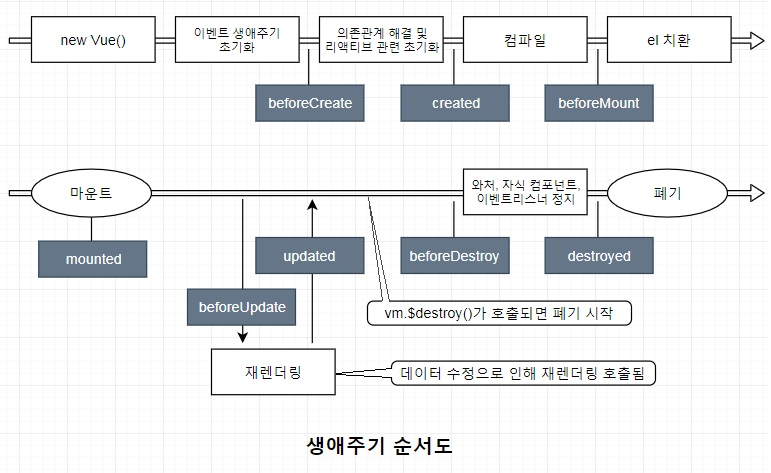
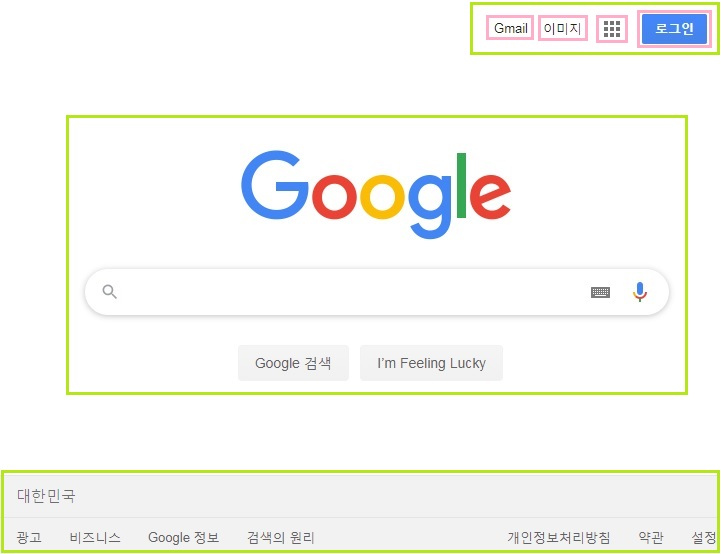
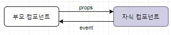

# 렌더링

## 과거방식과 SPA의 구동방식 비교

1. 전통방식

- html link tag의 href를 통해 주소를 바꾸고 해당 리소스를 서버에 요청한다.

- 이때 서버는 html로 화면을 표시하는데 부족함 없는 완전한 리소스를 클라이언트에 응답한다.

- 브라우저는 응답한 html을 수신하고 렌더링 한다.

- 이때 이전 페이지에서 수신된 html로 전환하는 과정에서 전체 페이지를 다시 렌더링하게 되므로

   

  ```
  새로고침
  ```

  이 발생한다.

  ```
  각 페이지 마다 고유 URL이 존재하므로 history관리 및 SEO 대응에 문제가 없다.
  ```

  =>

   

  *BUT*

   

  중복된 리소스를 요청마다 수신해야하며, 전체페이지를 다시 렌더링 하는 과정에서 새로고침이 발생하면서 사용성이 좋지 않다.

1. SPA

- APP에 필요한 리소스 모든 정적 리소스를 최초에 한번 다운로드한다.

- 새로운 페이지 요청 시, 페이지 갱신에 필요한 데이터만 전달받아 갱신한다.

  ```
  전체적인 트래픽 감소, 새로고침이 발생하지 않아 네이티브 앱과 유사한 사용자 경험
  ```

  =>

   

  *BUT*

   

  Link처리에 대한 고민이 필요하다.

  

# Vue.js

## 프로그레시브 프레임워크가 제공하는 단계적 영역


### 1. 선언적 렌더링(declaritive rendering)

선언적 DOM 렌더링과 관련된 영역

HTML 템플릿에 렌더링 대상을 선언적으로 기술해 데이터가 변경될 때마다 DOM을 반응적으로 렌더링하고 사용자 입력 데이터를 동기화할 수 있다.

Vue.js 본체가 제공하는 기능

### 2. 컴포넌트 시스템

UI를 모듈화해 재사용할 수 있게 해주는 영역

Vue.js 본체가 제공하는 기능

### 3. 클라이언트 사이드 라우팅

단일 페이지 애플리케이션이 동작하기 위해 필요한 영역

Vue.js 의 공식 라우팅 라이브러리 Vue Router를 사용해서 단일 페이지 애플리케이션을 만들 수 있다.

### 4. 대규모 상태 관리

컴포넌트 간 상태를 공유하는 방법을 필요로 하는 영역

Vue.js의 공식 데이터플로 아키텍처를 따라 만든 상태 관리 라이브러리인 Vuex를 사용해서 이 영역의 문제를 해결할 수 있다. 기존 컴포넌트를 확장하는 형태로 상태를 중앙에서 관리할 수 있다.

### 5. 빌드 시스템

웹 애플리케이션을 구성하는 컴포넌트 관리, 운영환경 배포, 프로젝트 구성 등과 관련된 영역

Vue.js의 공식 개발 지원 도구를 이용해 이 영역의 문제를 해결할 수 있다. 프로젝트의 환경 구축, 구성 관리에 수고를 들이는 대신 개발에 집중할 수 있다.

### 6. 클라이언트-서버 데이터 퍼시스턴스

웹 애플리케이션의 복잡한 데이터는 클라이언트 사이드와 서버 사이드 양쪽 모두에서 퍼시스턴스 데이터로 유지돼야 한다.

Vue.js 공식 라이브러리가 아직 없어서 서드파티 라이브러리(ex. axios, vue-apollo) 사용자들이 직접 작성한 라이브러리를 사용해 구현한다.


## 기반 기술

### 1. 컴포넌트 시스템

단일 파일에 HTML과 유사한 방식으로 컴포넌트를 작성할 수 있다. 이 파일은 .vue 라는 독자적인 확장자를 사용한다.(이 파일을 번들링 도구와 컴파일러를 사용해 Vue.js 컴포넌트로 등록할 수 있도록 객체로 변환해야 한다.)


파일 하나에 컴포넌트의 모든 요소를 함께 담을수 있는 장점이 있다.

HTML/CSS/자바스크립트 3가지 요소를 하나의 파일로 합쳐 컴포넌트로 분리할 수 있다.

### 2. 리액티브 시스템

Vue.js의 리액티브 시스템은 옵저버 패턴(observer pattern. 상태를 모니터링하는 옵저버와 모니터링 대상으로 구성되며 상태 변화 탐지에 사용되는 패턴)을 기반으로 구현된 것이다.

→ 상태의 변화를 Vue.js가 감지해 자동으로 그 변화를 DOM에 반영하는 구조

리액티브 프로퍼티와 와처(watcher)가 한 쌍을 이뤄 구현된다.


### 3. 렌더링 시스템

Vue.js는 가상 DOM(virtual DOM)을 이용해 DOM을 고속으로 렌더링한다.

가상 DOM(virtual DOM)은 DOM을 간편하고 빠르게 제어하기 위한 기술이다. 더 편리하고 빠르게 다룰 수 있는 DOM 구조의 대체물을 만든 다음, 이 대체물을 조작하고 그 결과를 실제 DOM에 반영한다.

다른 라이브러리나 프레임워크의 가상 DOM과 다른점

- 템플릿이 HTML과 유사해서 개발이 쉽다.
- 최적화가 잘 돼 있어 빠른 렌더링이 가능하다.


## Vue cli

환경 구축 도구


## 	data-binding

### 		1. one-way binding

자바스크립트문에서 vue 인스턴스를 생성해주고 데이터를 바인딩시켜준다.

- html

```html
<!DOCTYPE html>
<html>
<head>
  <meta charset="utf-8">
  <meta name="viewport" content="width=device-width">
  <title>JS Bin</title>
</head>
<body>
  
  <div id="app">
    <h1>hello, I'm {{name}}</h1>
  </div>
  
  <script src="https://cdn.jsdelivr.net/npm/vue/dist/vue.js"></script>
</body>
</html>
```


- js

```js
var app = new Vue({
  el: '#app', 
  data: {
    name: "funny coding",
  },
  // app 뷰 인스턴스를 위한 메소드들
  methods: {
  }
});
```


## Vue.js 기본 사용법

### UI 구성 요소

- **데이터**
- 데이터를 화면에 표시하는 **뷰**
- 사용자가 데이터를 수정하는 **액션**

가장 먼저 애플리케이션이 다루게 될 데이터를 정의한다.

그리고 데이터를 뷰에 어떻게 나타낼 것인지를 설명한다.

마지막으로 사용자 액션을 받는 방법을 설명한다.

### Vue.js 기능들

- 데이터
- 디렉티브
- 템플릿 문법
- 메서드
- 필터
- 생애주기 훅
- 계싼 프로퍼티
- 이벤트 핸들링

### 기존 UI개발의 문제점

jQuery로 UI 개발할 때는 버튼 등 DOM 요소에 이벤트가 발생할 때 호출되는 함수(이벤트 리스너)를 등록하고 이 함수가 자신 및 다른 DOM 요소를 조작하는 방식으로 동적인 UI를 구현한다.


event와 element의 수가 많아질수록, DOM과 event의 연결이 지나치게 복잡해질 것이다.

예를 들어 UI를 업데이트 할 때 특정 DOM 요소를 제외해야 할 경우를 생각해 보자. 각 이벤트 리스너에서 해당 DOM 요소를 참조하는 처리를 하나하나 골라가며 제외하지 않으면 안 된다. 이 과정은 너무 복잡하다.

반대로 DOM 요소를 추가해야 하는 경우에도 각 이벤트 리스너에 해당 DOM 요소에 대한 처리를 일일이 추가해야 한다.

애플리케이션의 규모가 커질수록 유지 보수가 어려워지며 확장성에도 문제가 발생한다.

### Vue.js를 이용한 UI 개발

Vue.js는 다음과 같이 이벤트와 요소 사이에 UI state가 끼어드는 형태이다.


jQuery를 사용하면 이벤트가 발생했을 때 요소를 어떻게 수정할지를 이벤트와 요소의 조합마다 정의해야 했다. 이런 경우 이벤트와 요소의 수가 늘어날수록 정의가 복잡해진다. 이에 비해 Vue.js를 사용하면 이벤트는 UI state를 수정하고, 수정된 UI state에 따라 DOM 트리/DOM 요소가 수정되는 두 가지 과정으로 나눠 단순화 할 수 있다.

jQuery나 DOM API를 사용해서 UI를 개발하면 UI의 상태가 DOM 트리 및 DOM 요소에 위치하게 되는 문제가 생긴다. 이러면 DOM 트리 구조의 변경으로 인해 원래대로라면 DOM 트리 및 DOM 요소와 관계가 없는 UI 상태를 다루는 로직이 영향을 받게 된다.

Vue.js 를 사용하면 UI 상태를 DOM 트리나 DOM 요소와 완전히 분리해 자바스크립트 객체 형태로 유지하면서 앞 장에서 설명한 리액티브 단방향 데이터 바인딩을 이용해 UI 상태의 변화에 맞춰 요소를 자동으로 업데이트하는 방법으로 이 문제를 해결한다.

|                     | jQuery                                                       | Vue.js                                                       |
| ------------------- | ------------------------------------------------------------ | ------------------------------------------------------------ |
| UI 개발의<br />중심 | DOM 트리 중심<br />UI의 상태정보는 DOM 트리가 갖고 있음<br />이벤트에 의해 DOM 트리를 수정 | UI state를 유지하는 자바스크립트 객체<br />1. UI state가 어떻게 자바스크립트 객체로 어떻게 나타낼 것인가.<br />2. 데이터 바인딩으로 UI state와 DOM 트리를 어떻게 매핑시킬 것인가.<br />3. 이벤트를 사용해 어떤 state를 변화시킬 것인가. |

### Vue 객체

#### 생성자

객체를 생성하는 함수를 말한다. new 연산자를 사용해야 한다.

이렇게 생선된 객체를 Vue 인스턴스라고 한다.

```js
var vm = new Vue({
    // .....
})
```

생성자에 옵션 객체를 인자로 전달하는데, 여기엔 여러 옵션이 들어갈 수 있다.

| 옵션 이름 | 내용                         |
| --------- | ---------------------------- |
| data      | UI 상태/데이터               |
| el        | Vue 인스턴스가 마운트된 요소 |
| filters   | 데이터를 문자열로 포매팅     |
| methods   | 이벤트 발생 시의 동작        |
| computed  | 데이터로부터 파생되는 값     |

Vue 인스턴스를 변수(위의 vm)에 대입한 이유는 여러 인스턴스끼리 서로 커뮤니케이션해야할 때 필요하기 때문이다.

#### 컴포넌트

Vue 객체의 component 메서드로 애플리케이션 전체에서 사용하는 컴포넌트를 등록할 수 있다.

또 Vue 인스턴스를 생성할 때 옵션의 components 프로퍼티에서 해당 Vue 인스턴스의 템플릿으로도 컴포넌트를 등록할 수 있다.


### Vue 인스턴스 마운트하기

#### 1. Vue 인스턴스의 적용(el)

옵션 객체의 el 프로퍼티로 지정한 DOM 요소가 마운트 대상이다. el 프로퍼티의 값은 DOM 요소의 객체(document.getElementById, document.querySelector 같은 API를 사용해 받아온 객체)나 CSS 셀렉터 문자열(#app, .app 클래스같이 일치하는 요소가 여러개인 경우 가장 먼저 나오는 것에 적용)로 지정할 수 있다.

```js
var vm = new Vue({
    el: "#app",
    // ...
})
```

#### 2. 메서드를 이용한 마운트($mount 메서드)

메서드를 호출하는 방법으로도 Vue 인스턴스를 마운트할 수 있다. el 프로퍼티를 정의하는 대신 $mount 메서드를 사용하면 된다.

마운트 대상 DOM 요소가 UI 조작이나 통신 등을 통해 지연적으로 추가되는 경우, 요소가 추가되기를 기다려 마운트해야 하므로 이런 방법을 사용한다.

```JS
var vm = new Vue({
    // ...
}).$mount("#app");
```


### UI 데이터 정의(data)

UI의 state가 되는 데이터 객체. data 프로퍼티의 값은 Vue.js의 리액티브 시스템에 포함된다. data 프로퍼티의 값이 변경될 때마다 Vue.js가 이를 자동으로 탐지해 표시 내용이 바뀌는 등의 처리를 수행한다. Vue 인스턴스를 생성할 때 data 프로퍼티를 전달하고 이를 이용해 템플릿의 내용을 출력하는 것이 Vue.js로 화면의 내용을 출력하는 기본 방법이다.

#### $watch를 이용한 모니터링

```js
let items = [
    {
        name: "사또밥",
        price: 1000,
        quantity: 3
    },
    {
        name: "새우깡",
        price: 700,
        quantity: 5
    },
    {
        name: "버터링",
        price: 2200,
        quantity: 4
    }
];
let app = new Vue({
    el: "#app",
    data: {
        items: items
    },

})
app.$watch(function (){
    return this.items[0].quantity;
}, (quantity)=>{
    console.log(quantity)
})
```

```html
<div id="app">
        <ol>
            <li v-for="e in items">품목 : {{ e.name }} <br>가격 : {{ e.price }}<br>수량 : {{ e.quantity }}</li>
        </ol>
    </div>
```


### 템플릿 문법

템플릿은 Vue 인스턴스의 데이터와 뷰(DOM 트리)의 관계를 선언적으로 정의하는 역할을 한다(= 데이터가 있다면 뷰의 내용이 결정된다).

앞에서 데이터를 수정하면 자동으로 뷰도 수정된 것 처럼 데이터의 변경에 따라 뷰를 업데이트 해주는 기능을 **데이터 바인딩**이라고 한다.

Vue.js 템플릿 문법에서 중요한 것은 다음 2가지 개념이다.

1. Mustache 문법을 이용한 데이터 전개
2. 디렉티브를 이용한 HTML 요소 확장

첫번째 개념은 데이터를 HTML 텍스트 콘텐츠로 전개하는 것이다. 자바 스크립트 객체에 든 데이터를 템플릿 안에 적용해 텍스트 콘텐츠를 만들 때 사용한다.

data 등의 자바스크립트 객체는 텍스트 콘텐츠 외에도 디렉티브 속성값 등으로도 사용한다.

`<span v-show="isTrue">{{ message }}</span>`

##### 1) 텍스트로 전개하기

{{ }} 사이에서 data 프로퍼티에 정의한 데이터나 계산 프로퍼티, 메서드, 필터를 참조할 수 있다.

```html
<p>
    {{ items[0].name }}: {{ items[0].price }} x {{ items[0].quantity }}
</p>
```

데이터가 변경되면 자동으로 뷰를 다시 렌더링 하거나 DOM을 업데이트한다. 데이터를 뷰에 반영하는 일은 Vue.js가 대신 해준다.

##### 2) 속성값 전개하기

텍스트 외에 DOM 요소의 속성에도 값을 전개할 수 있다. 속성에 값을 전개하려면 Mustache 문법 대신 Vue.js가 제공하는 디렉티브인 v-bind를 사용한다.

`v-bind:속성명="데이터를 전개한 속성값"`	형태로 사용한다.

마우스 오버했을 때 메세지가 나타나도록 title 속성에 data 프로퍼티 값을 지정해보고 data 프로퍼티 값에 따라 버튼을 활성/비활성화 시켜보자.

```html
<button id="btn" v-bind:title="message" v-bind:disabled="!canBuy">
    구매하기
</button>
<script>
	var vm = new Vue({
        el: "#btn",
        data: {
            message: "로그인 후에 구매가 가능합니다.",
            canBuy: true
        }
    })
</script>
```

여기서 주의할 점은 태그의 속성의 값이 true/false로 전환되는게 아니라, 아예 태그의 속성 자체가 추가/삭제되는 원리이다.

##### 3) 자바스크립트 표현식 전개하기

데이터 바인딩뿐만 아니라 자바스크립트 표현식도 전개가 가능하다. {{}} 안에서뿐만 아니라 속성값도 마찬가지다.

자바스크립트 표현식은 각 ㄱ바인딩의 하나의 단일 표현식만 사용할 수 있으므로, 복잡한 표현식의 경우 filter나 computed, methods를 사용하자.

```html
<p>{{items[0].price * items[0].quantity}}</p>
```


### 필터(filters)

일반적인 텍스트 포매팅 기능을 제공하며(data 객체 각 프로퍼티의 key-value 바인딩), 생성자 옵션 중 한 가지이다. 

Date 객체를 YYYY/mm/dd와 같은 포맷으로 변환하거나 숫자 0.5를 퍼센트 단위("50%")로 변환하는 경우 등에 사용한다.

필터는 생성자에서 옵션 filters에 인자 하나를 받는 함수 형태로 정의한다(Vue 전역변수를 제공하는 API(Vue.filter)에서 정의하면 애플리케이션 전체에서 해당 필터를 사용할 수 있다. 이는 필터 외에 디렉티브 등에서도 똑같다).

`{{ 값 | 필터명 }}`

템플릿에서 {{}} 문법과 |(파이프) 연산자를 조합해 사용한다. 파이프 연산자 왼쪽에 오는 값이 필터의 인자가 된다.

```js
let vm = new Vue({
    el: "#app",
    data: {
        items: items
    },
    filters: {
        numberWithDelimiter: function(e){
            if(!e){
                return "0"
            }
            return value.toString().replace(/(\d)(?=(\d{3})+$)/g, '$1,')
        }
    }
})
```


### 계산 프로퍼티(computed)

어떤 데이터에서 파생된 데이터를 프로퍼티로 공개하는 기능으로, Vue 생성자의 옵션 객체의 한가지이다.

데이터를 모종의 방법으로 처리한 값을 프로퍼티로 삼고 싶을 때(인스턴스에 저장해 다른 곳에서 참조하고 싶을 때) 이 계산 프로퍼티를 사용하는데, 대개 복잡한 식을 템플릿에 나타내는 용도로 사용된다.

```html
<div id="app">
    <p>
        합계: {{ items.reduce(function(sum,item){ return sum + (item.price * item.quantity)}, 0);}}
    </p>
</div>
```

위처럼 Mustache 문법으로 작성해도 동작은 하지만 코드가 너무 길고 여기서 계산하는 값을 한눈에 이해하기가 어렵다. 여기에 계산 프로퍼티를 사용해보자.

```html
<div id="app">
    <p>
        합계: {{ totalPrice }}
    </p>
</div>
<script>
	new Vue({
        // ...마운트 및 데이터 정의
        computed: {
            totalPrice: function (){
                return this.items.reduce(function(sum,item){
                    return sum + (item.price * item.quantity);
                }, 0)
            }
        }
    })
</script>
```

호출을 의미하는 ()를 사용할 필요는 없다.

함수 형태로 정의했지만, 참조할 때는 메서드가 아니라 프로퍼티로 취급된다.

#### this 참조하기

계산 프로퍼티 및 메서드를 이용해 데이터(data 객체)와 계산 프로퍼티를 참조할 때는 `this`를 거쳐서 참조해야 한다. 이 `this`가 가리키는 대상은 Vue 인스턴스 자신이다. data와 computed의 내용은 프로퍼티로 공개되므로 인스턴스에서 직접 참조할 수 있다.


### Directive(지시문)

Directive란?

- HTML 속성 값을 이용해 문법을 확장
- Vue 의 기능들을 사용하기 위해서 사용하는, HTML 태그 안에 들어가는 하나의 속성
- v-`something` 의 형식으로 사용한다.
- 13개의 종류가 있다.


#### 1. v-text

```html
<div id="app">
    <h1>
    	Hello, I'm {{ name }}
	</h1>
</div>
```

위의 one-way binding을 directive로 같은 기능을 구현해보자.

```html
<div id="app">
    <h1>
        Hello, I'm <span v-text="name"></span>
    </h1>
</div>
```

v-text를 사용하면 태그의 inner text값이 덮어쓰기 된다.

```js
var app = new Vue({
  el: '#app', // 어떤 엘리먼트에 적용을 할 지 정합니다
  // data 는 해당 뷰에서 사용할 정보를 지닙니다
  data: {
    name: '<i>이탈릭</i>'
  }   
});
```

v-text의 경우 data에 태그를 넣어줘도 text로 인식을 한다.

보안적으로 사용할 수도 있다. (XSS 방지)


#### 2. v-html

data 안에 html 태그를 사용하고 싶을 때 v-text대신 사용할 수 있다.

```html
<div id="app">
    <h1>
        <!-- 이제 태그가 적용이 된다. -->
        Hello, I'm <span v-html="name"></span>
    </h1>
</div>
```

React의 `dangerouslySetInnerHTML` 과 비슷하다.

이 디렉티브를 사용할 땐 악성코드 필터링에 주의하자.


#### 3. v-show

해당 엘리먼트를 display 할지, 말지 true/false로 지정할 수 있다.

먼저, 자바스크립트문에 v-show 디렉티브에 사용할 데이터를 설정해주자.

```js
var app = new Vue({
    el: "#app",
    data: {
        name: "<u>funny coding</u>",
        visibility: true
    }
});
```

```html
<div id="app">
    <h1>
        <!-- 이제 태그가 적용이 된다. -->
        Hello, I'm <span v-show="visibility" v-html="name"></span>
    </h1>
</div>
```

이제 app.visibility를 true로 해주면 출력되고 false로 해주면 숨겨진다.

###### v-show와 v-if의 차이점

- v-show는 display 프로퍼티 값을 바꿔주는 개념이기 때문에 트리에서 삭제되지는 않는다.
- v-if는 조건에 따라 DOM 요소를 생성/삭제되기 된다.
- 일반적으로 스타일을 수정하는 쪽보다 DOM을 수정하는 쪽이 렌더링 비용이 더 크기 때문에 변화가 잦은 엘레멘트의 경우에는 v-show를 사용하는게 렌더링 비용이 더 적다.
- 로그인 여부를 확인해 데이터를 받아올 때 처럼 평가 값이 한번밖에 변하지 않는 경우 초기 상태에서 DOM 요소를 생성하지 않고 렌더링 비용을 절약하고 나중에 요소를 생성하는 것이 이상적이다.


#### 4. v-if

조건문을 사용하여 엘리멘트가 출력될지 말지 설정할 수 있다. 위의 v-show 디렉티브와 비슷하다.

```js
var app = new Vue({
    el: "#app",
    data: {
        name: "3보다 값이 큽니다.",
        visibility: true,
        value: 0
    }
});
```

```html
<div id="app">
    <h1>
        <!-- 이제 태그가 적용이 된다. -->
        Hello, I'm <span v-if="value>3" v-html="name"></span>
    </h1>
</div>
```

v-if 디렉티브 안의 조건문이 만족되는 경우에만 출력이 되는 걸 확인할 수 있다.


#### 5. v-else

v-if 디렉티브와 함께 사용하며 v-if의 조건을 만족하지 않을 경우 다른 내용을 출력하기 위한 디렉티브이다.

```html
<div id="app">
    <h1>
        <!-- 이제 태그가 적용이 된다. -->
        Hello, I'm <span v-if="value>3" v-html="name"></span>
        <span v-else>value가 3이하네요</span>
    </h1>
</div>
```


#### 6. v-else-if

v-if 디렉터리의 조건을 만족하지 않을 때 체크 할 다른 조건을 설정해줄 수 있다.

v-if와 v-else 사이에 사용되어야 하며 여러번 사용될 수 있다.

```html
<div id="app">
    <h1>
        <!-- 이제 태그가 적용이 된다. -->
        Hello, I'm <span v-if="value>3" v-html="name"></span>
        <span v-else-if="value>0">3보단 작지만 0보단 크네요</span>
        <span v-else>value가 3이하네요</span>
    </h1>
</div>
```


#### 7. v-bind

`v-bind:속성이름="데이터를 전개한 속성값"`

속성 이름을 정의할 때 파스칼 케이스(fruitsItem)대신 케밥 케이스(fruits-item)를 사용해야 한다.(왜일까?)

ex)

##### class 바인딩

`v-bind:class="객체 혹은 배열"`

```html
<p v-bind:class="{nav: true, maindscr: false}"></p>
<p v-bind:class="'nav'"></p>
<p v-bind:class="{error: !canBuy}"></p>
```

객체를 속성값으로 받으면 값이 참인 프로퍼티의 이름을 class 속성의 값으로 반영한다.

```js
computed: {
    errorMessageClass: function(){
        return {
            error: !this.canBuy
        }
    }
}
```

```html
<p v-bind:class="errorMessageClass">
	1000원 이상부터 구매 가능
</p>
```

##### style 바인딩

`v-bind:style="객체 혹은 배열"`

```html
<p v-bind:style="{color: 'red', border: '1px solid red'}"></p>
<p v-bind:style="{color: (canBuy? '':'red'), border: (canBuy? '':'1px solid red')}"></p>
```

속성값 객체나 배열이 복잡해지면 계산 프로퍼티 형태로 바꾸는 것이 유리하다

```js
errorMessageStyle: function(){
    return {
        border: this.canBuy? '':'1px solid red',
        color: this.canBuy? '':'red'
    }
}
```

```html
<p v-bind:style="errorMessageStyle">
    1000원 이상부터 구매 가능
</p>
```

##### 생략 표기법

v-bind는 가장 많이 쓰이는 디렉티브 중 하나다. 이 때문에 간결한 표기를 위한 생략 표기법을 지원한다.

`:속성명`

```html
<p :class="{error: !canBuy}">
    1000원 이상부터 구매 가능
</p>
```


- javascript

```js
// 새로운 뷰를 정의합니다
var app = new Vue({
  el: '#app', // 어떤 엘리먼트에 적용을 할 지 정합니다
  // data 는 해당 뷰에서 사용할 정보를 지닙니다
  data: {
    name: 'Vue',
    feelsgood: 'https://imgh.us/feelsgood_1.jpg'
  }   
});
```

- html

```html
<div id="app">
    <h1>Hello, {{ name }}</h1>
    
</div>
```

조금 더 간단하게 쓰기 위하여 v-bind도 생략시켜 줄 수 있다.

```html
<div id="app">
    <h1>Hello, {{ name }}</h1>
    
</div>
```

머스태쉬 {{ }} 나, 디렉티브를 사용할 때 내부값을 꼭 뷰 인스턴스의 데이터 명으로 해야되는건 아니다. 이 안에도 자바스크립트 표현식을 사용할 수 있다.

예를들어, v-bind 디렉티브에 자바스크립트 표현식을 써보자.

- js

```js
// 새로운 뷰를 정의합니다
var app = new Vue({
  el: '#app', // 어떤 엘리먼트에 적용을 할 지 정합니다
  // data 는 해당 뷰에서 사용할 정보를 지닙니다
  data: {
      name: 'Vue',
      feelsgoodman: 'https://mmorpg.net/wp-content/uploads/2018/11/feelsgoodman-300x273.png',
      feelsbadman: 'https://2static.fjcdn.com/pictures/Feels_9c41c0_6042240.jpg'
  }   
});
```

- html

```html
<div id="app">
    <h1>Hello, {{ name }}</h1>
    
    <h1>
        {{ Date() }}
    </h1>
</div>
```


#### 8. v-pre

해당 엘리멘트는 디렉티브가 없다고 알리는 특수한 디렉티브이다.

디렉티브가 필요없는 엘리멘트에게 v-pre를 사용하면 vue 시스템이 엘리멘트가 디렉티브가 없다고 인식하기 때문에 그 엘리멘트 내부의 자식 엘리멘트들을 무시하고 건너뜀으로서 컴파일 속도가 빨라진다.

```html
<div id="app">
    <h1>
        <!-- 이제 태그가 적용이 된다. -->
        Hello, I'm <span v-if="value>3" v-html="name"></span>
        <span v-else-if="value>0">3보단 작지만 0보단 크네요</span>
        <span v-else>value가 3이하네요</span>
        <span v-pre>{{ 그대로 컴파일 해주세요 }}</span>
    </h1>
</div>
```


#### 9. v-cloak

우리가 웹 페이지를 로드할 때 자바스크립트 코드가 실행되기까지의 시간이 필요하다. 자바스크립트 코드가 실행되기 전까지는 숨기고 싶은 내용들도 모두 출력 될 수 있는데, 이를 막기 위해 v-cloak 디렉티브를 사용한다.

즉, Vue 인스턴스가 제대로 준비될 때 까지 우리의 템플렛을 위한 html 코드를 숨기고 싶을 때 이 디렉티브를 사용한다.

숨기고 싶은 태그에 v-cloak를 넣어주자.

```html
<div id="app" v-cloak>
    <h1>
        <!-- 이제 태그가 적용이 된다. -->
        Hello, I'm <span v-if="value>3" v-html="name"></span>
        <span v-else-if="value>0">3보단 작지만 0보단 크네요</span>
        <span v-else>value가 3이하네요</span>
        <span v-pre>{{ 그대로 컴파일 해주세요 }}</span>
    </h1>
</div>
```

그 다음 css 를 지정해주어야 한다.

```css
[v-cloak]{
    display: none;
}
```


#### 10. v-once

해당 엘레멘트를 초기에 **딱 한번만 렌더링**한다. 즉, 자바스크립트 데이터를 사용하는 엘레멘트중 변동이 없거나 초기값만 보여주고 싶은 경우 사용하면 된다.

```html
<div id="app" v-cloak>
    <h1 v-once v-if="value > 5">value 가 5보다 크군요</h1>
    <h1 v-else-if="value === 5">값이 5네요</h1>
    <h1 v-else>value 가  5보다 작아요</h1>.
    <h1 v-pre>{{ 이건 그대로 렌더링해줘요 }}</h1>
    
    <h2 v-once>초기 값: {{ value }}</h2>
	<h2>현재 값: {{ value }}</h2>
</div>
```


#### 11. v-for

html에서 for-loop를 구현하기 위해서 사용한다. ex) 게시판의 게시물 목록 렌더링

이 디렉티브를 반복할 태그에서 `item in items`의 형식으로 작성한다.

- item : 이것은 별칭이기 때문에 편의상 item이라 명명한 것이지 우리 마음대로 설정해도 된다.
- items : Vue 인스턴스 안에 있는 데이터 이름이다.

예를들어, Todolist를 만든다고 생각해보자.

- js

```js
var app = new Vue({
  el: '#app', 
  data: {
    todos: [
      { text: 'Vue.js 튜토리얼 작성하기' },
      { text: 'Webpack2 알아보기' },
      { text: '사이드 프로젝트 진행하기' }
    ]
  }   
});
```

- html

```html
  <div id="app">
    <h2>오늘 할 일</h2>
    <ul>
      <li v-for="todo in todos">{{ todo.text }}</li>
    </ul>
  </div>
```

- html (index를 사용하고 싶은 경우)

```html
  <div id="app">
    <h2>오늘 할 일</h2>
    <ul>
      <li v-for="(e, i) in todos">{{i}} : {{ todo.text }}</li>
    </ul>
  </div>
```

forEach를 사용한다고 생각하면 된다.


#### 12. v-model

이전에 머스태쉬 {{ }} 를 사용한 데이터 출력은, 단방향 데이터 바인딩 이었다.

- 단방향 데이터 바인딩 : 데이터 → 뷰
- 데이터 값이 변하면 바로 업데이트가 된다.

이를 양방향 데이터 바인딩으로 바꿔서 데이터가 뷰를 바꿀 뿐 아니라 뷰의 값이 바뀔 때 데이터 값도 바뀔 수 있도록 해보자.

- html

```html
<div id="app">
    <h1>Hello, {{ name }}</h1>
    <input type="text" v-model="name"/>
</div>
```

- js

```js
var app = new Vue({
  el: '#app', 
  data: {
    name: "<u>funny coding</u>",
    text: "아직 없음"
  },
  // app 뷰 인스턴스를 위한 메소드들
  methods: {
  }
});
```

이 디렉티브를 체크박스와 연동해서 토글 기능도 만들 수 있다.

- html

```html
<div id="app">
    <h1>Hello, {{ name }}</h1>
    <input type="text" v-model="name"/>
    <input type="checkbox" v-model="check"/>
    <h1 v-text="check? '있었는데?':'없었습니다.'"></h1>
</div>
```

- js

```js
var app = new Vue({
  el: '#app', 
  data: {
      name: "<u>funny coding</u>",
      text: "아직 없음",
      check: true
  },
  // app 뷰 인스턴스를 위한 메소드들
  methods: {
  }
});
```

이렇게 v-model을 사용하면 양방향 데이터 바인딩이 가능하지만, 이것만으론 부족하다. 프로젝트를 완벽하게 만들기 위해선 이벤트를 다뤄줄 디렉티브 v-on이 필요하다.


#### 13. v-on

드디어 methods를 사용할 때가 되었다. v-on을 사용해서 이벤트를 발생시 처리를 할 수 있는데, 그 동작을 정의하기 위해 methods를 정의해서 사용하자.

v-on을 사용할 때는 `v-on:이벤트이름="메소드이름"` 형식으로 사용해보자.

생략 표기법

`@이벤트이름` ex) `@click`

카운터를 만들면서 사용법을 익혀보자.

- js

```js
let app = new Vue({
    el: "#app",
    data: {
        count: 0
    },
    methods: {
        plus: ()=>{
            this.count++;
        },
        minus: ()=>{
            this.count--;
        }
    }
})
```

- html

```html
<div id="app">
    <h1>
        초기 숫자 : <span v-once v-text="count"></span>
        현재의 숫자 : {{ count }}
        차이는 알아서 계산하세요
    </h1>
    <button v-on:click="plus">
        플러스
    </button>
    <button v-on:click="minus">
        마이너스
    </button>
</div>
```

### 생애주기 훅(lifecycle hook)

Vue 인스턴스는 생성부터 소멸까지 생애주기를 갖는다.

예를 들어 컴포넌트 표시 여부를 v-if 디렉티브로 제어하고 있다면 조건이 참이 됐을 때 Vue 인스턴스가 생성되고, 그 후 사용자 조작으로 업데이트가 반복되다가 v-if 조건이 거짓이 되면 Vue 인스턴스가 폐기된다.

Vue 인스턴스의 중요도 순서대로 수행할 처리를 미리 등록해두고 해당 시점에 자동으로 그 처리 내용을 호출하게끔 할 수 있다.

#### 1. 생애주기 훅의 종류와 호출 시점

등록 시점의 종류는 create, mounted, destroyed 등이 있다. Vue 인스턴스 생성자(컴포넌트)의 옵션의 시점 프로퍼티 안에 해당 시점에 실행 할 함수를 값으로 지정한다.

| 훅 이름       | 훅이 호출되는 시점                               |
| ------------- | ------------------------------------------------ |
| beforeCreate  | 인스턴스가 생성된 다음 데이터가 초기화되는 시점  |
| created       | 인스턴스가 생성된 다음 데이터 초기화가 끝난 시점 |
| beforeMount   | 인스턴스가 DOM 요소에 마운트되는 시점            |
| mounted       | 인스턴스가 DOM 요소에 마운트가 끝난 시점         |
| beforeUpdate  | 데이터가 수정돼 DOM에 반영되는 시점              |
| updated       | 데이터가 수정돼 DOM에 반영이 끝난 시점           |
| beforeDestroy | Vue 인스턴스가 폐기되기 전                       |
| destroyed     | Vue 인스턴스가 폐기된 다음                       |

그림으로는 다음과 같다.



이제 자주 사용하는 훅을 살펴보자.

#### 2. created 훅

인스턴스가 생성되고 데이터가 초기화된 시점에 실행된다. 이 단계는 아직 DOM 요소가 인스턴스와 연결된 상태가 아니다.

그러므로 아직 인스턴스의 $el 프로퍼티와 DOM API의 getElementById, querySelectorAll 을 사용해서 DOM 요소를 반환받을 수 없는 상태이다.

이 훅은 Vuex를 적용하지 않은 소규모 애플리케이션에서 웹 API를 통해 데이터 관련 처리를 시작하거나 setInterval, setTimeout을 반복 실행해야 하는 타이머 처리를 시작하는 시작점으로 사용한다.

#### 3. mounted 훅

인스턴스와 DOM 요소가 연결된 시점에 실행된다. 인트선트의 $el 프로퍼티나 querySelectorAll 같은 DOM API를 사용할 수 있는 시점이므로 DOM 조작 및 이벤트 리스너 등록은 이 훅을 사용하면 된다.

#### 4. beforeDestroy 훅

인스턴스가 폐기되기 직전에 실행된다. mounted 훅에서 DOM 요소에 등록한 이벤트 리스너나 타이머 등을 '뒷정리'해서 메모리 누수를 막는다.


위의 훅들이 실행되는 시점을 타이머 처리 예제로 확인해보자.

```html
<!DOCTYPE html>
<html lang="en">
<head>
    <meta charset="UTF-8">
    <meta name="viewport" content="width=device-width, initial-scale=1.0">
    <meta http-equiv="X-UA-Compatible" content="ie=edge">
    <title>Document</title>
    <script src="https://unpkg.com/vue"></script>
</head>
<body>
    <div id="app">
        <p>{{count}}</p>
    </div>
    <script>
        let vm = new Vue({
            el: "#app",
            data: function() {
                return {
                    count: 0,
                    timerId: null
                }
            },
            beforeCreate: function(){
                console.log("beforeCreate");
                // 데이터 초기화가 아직 안됐으므로 undefined임
                console.log(this.count);
            },
            created: function(){
                console.log("created");
                let that = this
                // 데이터에서 참조 가능
                console.log(this.count);
                // DOM 요소가 연결되지 않았으므로 undefined임
                console.log(this.$el);
                // 타이머 시작
                this.timerId = setInterval(function(){
                    that.count += 1
                }, 1000)
            },
            mounted: function(){
                console.log("mounted");
                // DOM 요소가 연결됨
                console.log(this.$el);
            },
            beforeDestroy: function(){
                console.log("beforeDestory");
                // 타이머 정리
                clearInterval(this.timerId);
            }
        })
        window.vm = vm
    </script>
</body>
</html>
```

$destroy 메서드를 호출하는 방법으로 수동으로 인스턴스를 폐기할 수 있다.

`vm.$destroy()`


### 메서드(methods)

데이터 수정 및 서버에 HTTP 요청을 보낼 때 사용한다.

```js
methods: {
    메서드명: function(){
        // 원하는 처리
    }
}
```

v-on 디렉티브의 속성값에 바인딩하고 뷰에서 이벤트가 발생했을 때 호출되는 형태로 사용하는 것이 가장 흔하다. 템플릿에서도 {{메서드명}}과 같은 형태로 텍스트 전개에 사용할 수 있다.

```html
<button :disabled="!canBuy" @click="doBuy">구매</button>
```

메소드명을 속성값으로 사용했다면 이벤트 객체가 기본 인자로 메서드에 전달된다. 이 이벤트 객체는 표현식에서 $event 라는 특별한 이름으로 참조할 수 있는데, 앞서 본 템플릿과 같은 동작을 표현식으로 구현하려면 다음과 같이 하면 된다.

```html
<button :disabled="!canBuy" @click="doBuy($event)">구매</button>
```

#### 1. 이벤트 객체

이벤트 객체는 이벤트가 발생한 요소와 좌표 등의 정보를 담고 있으며, 표준 DOM API의 addEventListener에서 첫 번째 인자로 받는 이벤트 객체와 동일한 것이다.

```js
methods: {
    메서드 이름: function(event){
        // 인자 event는 이벤트 객체
    }
}
```

---

##### 계산 프로퍼티의 캐싱 메커니즘

계산 프로퍼티는 해당 프로퍼티가 의존하는 데이터가 수정되지 않는 한 앞서 계산한 결과를 캐시해두는 특징이 있다. 같은 기능을 메서드로 구현할 수는 있으나 메서드는 계산 결과가 캐시되지 않으므로 호출될 때마다 값을 다시 계산한다. 이런 특징 때문에 계산한 결과를 재사용할 수 있는 계산 프로퍼티를 사용하는 것이 좋다.

단, 계산 프로퍼티의 계산 값의 캐싱은 **의존 데이터의 변화를 기준으로 한다**. 그러므로 Vue 인스턴스의 데이터가 아닌 현재 시각이나 DOM의 상태 등 외부에서 받은 정보, 사이드 이펙트가 따르는 값을 사용한 경우에는 이들 값이 변화한 것을 탐지할 수 없기 때문에 재계산이 일어나지 않는다.

```js
var vm = new Vue({
    el: "#app",
    data: {
        messagePrefix: "Hello"
    },
    computed: {
        message: function() {
            let timestamp = Date.now();
            return this.messagePrefix + ", " + timestamp;
        }
    }
})
```

위의 계산 프로퍼티 message는 인사 메시지와 타임 스탬프 값을 출력한다. 이 값은 messagePrefix 값이 변경되기 전까지는 캐시된 값을 그대로 반환할 것이다.

---

이벤트 객체를 이용해 preventDefault나 stopPropagation 같은 이벤트의 동작을 제어하는 메서드를 호출할 수도 있다. 예를 들어 링크를 클릭했을 때 URL로의 페이지 이동을 preventDefault를 호출해서 방지할 수 있다. stopPropagation은 이벤트가 조상 요소에 전파되는 것을 막는 메서드다.

```html
<button :disabled="!canBuy" @click.prevent="doBuy">구매</button>
```


## 컴포넌트의 기초

### 컴포넌트란?

웹 애플리케이션 UI는 이를 구성하는 여러 부품의 조합으로 볼 수 있다.

예를 들어 구글의 최상위 페이지는 Gmail이나 로그인 링크 등을 모아놓은 헤더, 검색창, 면책 조항 링크 등을 모아놓은 푸터, 이렇게 3개 요소로 구성된다. 헤더를 더 세세하게 나누면 Gmail 링크와 로그인 버튼으로 나뉜다. 이러한 부품들을 UI 컴포넌트라고 한다.




- 웹사이트의 규모와 상관없이 이러한 컴포넌트가 트리 구조를 이룬 컴포넌트 트리 형태로 구성된다
- 한 페이지 안에서 기능이나 외관이 비슷한 부분, 서로 다른 페이지끼리도 재사용할 수 있는 부분 등 같은 UI 컴포넌트가 반복적으로 사용된다.

#### 장점

- 재사용성 향상 → 개발 효율성이 좋아짐
- 이미 사용하는 컴포넌트를 재사용 → 품질 보장
- 적절히 분할한 컴포넌트가 느슨하게 결합하므로 유지 보수성 향상
- 캡슐화를 통해 개발 작업에서 신경 써야 할 부분을 최소화


#### Vue.js의 컴포넌트 시스템

Vue.js는 컴포넌트 지향에 방점을 찍은 UI 라이브러리다.

Vue.js의 컴포넌트란 재사용 가능한 Vue 인스턴스를 의미한다.

```js
Vue.component("list-item",{
    template: "<li>foo</li>"
})
```

위의 코드는 Vue.js의 컴포넌트이다. `Vue.component()`의 첫 번째 인자가 컴포넌트명이고, 두 번째 인자는 컴포넌트의 내용 등을 담은 옵션이다. 단순하지만 완전한 Vue.js 컴포넌트다.

##### Vue 컴포넌트는 재사용할 수 있는 Vue 인스턴스이다.

따라서 Vue 컴포넌트 안에서 템플릿 문법을 사용할 수 있다.

```html
<ul id="example">
    <list-item></list-item>
</ul>

<script>
	// 컴포넌트
    Vue.component("list-item",{
    	template: "<li>{{message}}</li>",
        data: function(){
            return {message: "안녕하세요"}
        }
	})
    
    // 최상위 Vue 인스턴스 생성
    new Vue({ el: '#example' })
</script>
```


### Vue 컴포넌트 정의하기

Vue 컴포넌트는 용도에 따라 전역 컴포넌트와 지역 컴포넌트로 정의한다. 정의하는 방법 역시 Vue.component()를 사용하는 커스텀 태그 방식과 Vue.extend()를 사용하는 하위 생성자 방식으로 나뉜다.

#### 1. 전역 컴포넌트 정의하기

가장 일반적인 방법인 커스텀 태그 방식으로 정의해보자.

Vue.component() API를 사용한다.

```js
Vue.component(tagName, options)
```

첫번째 인자 tagName은 여기서 만들 컴포넌트의 이름을 값(문자열)으로 받는다. 이 문자열이 커스텀 태그의 태그명이 된다. 두번째 인자 options는 컴포넌트 자체에 대한 여러 가지 설정 정보를 담은 객체를 값으로 받는다. 이 객체의 내용은 기본적으로 Vue 인스턴스의 설정 옵션, template, props, 생애주기 훅 등도 사용할 수 있다.

> el은 최상위 Vue 인스턴스만이 추가할 수 있다. 컴포넌트가 여러 곳에서 재사용하기 위해 만든 것임을 생각하면 el을 지정할 수 없는 이유는 자연스러운 것이다.

| 옵션 이름  | 용도                            |
| ---------- | ------------------------------- |
| data       | UI 상태 및 데이터               |
| filters    | 데이터를 문자열로 포매팅        |
| methods    | 이벤트가 발생했을 때의 동작     |
| computed   | 데이터에서 파생된 값            |
| template   | 컴포넌트 템플릿                 |
| props      | 부모 컴포넌트로부터 받은 데이터 |
| created 외 | 생애주기 훅(생성 시점)          |

이 중 컴포넌트를 정의할 때 사용하는 것이 template과 props다. template은 컴포넌트에서 사용할 템플릿을 정의하는 옵션이다. props는 상위 컴포넌트에서 커스텀 태그를 사용할 때 하위 컴포넌트가 전달받는 값을 저장할 변수를 정의하는 옵션이다.

##### 컴포넌트 구현의 간단한 예제

```html
<div id="example" :style="style">
        <fruit-title></fruit-title>
        <fruit-dscr></fruit-dscr>
        <fruit-table></fruit-table>
    </div>
    <script>
        // 컴포넌트
        Vue.component("fruit-title", {
            template: "<h1>{{message}}</h1>",
            data: function () {
                return { message: "과일 목록" }
            }
        });
        Vue.component("fruit-dscr", {
            template: "<p>{{message}}</p>",
            data: function(){
                return { message: "각 계절 대표적 과일의 목록"}
            }
        });
        Vue.component("fruit-table", {
            template: `
                <table :style="tableStyle">
                    <tr>
                        <th :style="thStyle">
                            계절
                        </th>
                        <th :style="thStyle">
                            과일
                        </th>
                    </tr>
                </table>
            `,
            data: function(){
                return {
                    tableStyle: {
                        width: "100%",
                    },
                    thStyle: {
                        border: "1px solid grey"
                    }
                }
            }
        })

        // 최상위 Vue 인스턴스 생성
        new Vue({
            el: '#example',
            data: {
                style: {
                    position: "absolute",
                    top: "50%",
                    left: "50%",
                    transform: "translate(-50%,-50%)",
                    textAlign: "center"
                }
            }
        })
    </script>
```

##### 컴포넌트 재사용하기

일반적인 Vue 인스턴스는 한 번 밖에 사용할 수 없지만, 컴포넌트는 여러 번 사용할 수 있다.

##### 자식 컴포넌트와 부모 컴포넌트

컴포넌트 간에 부모자식 관계를 가질 수 있다(최종 결과로 렌더링될 DOM 요소 간의 부모자식 관계와 같다).


#### 2. 생성자를 사용해서 컴포넌트 정의하기

전역 API Vue.extend()를 사용해서 Vue 생성자를 상속받는 하위 생성자를 만들 수 있다. 이 하위 생성자를 사용하는 방법으로도 컴포넌트를 만들 수 있다.

정의한 컴포넌트를 특정 요소에 바로 마운트하기 위해 `$mount` 함수를 사용한다.

```js
let FruitsListTitle = Vue.extend({
    template: "<h1>과일 목록</h1>",
})

new FruitsListTitle().$mount("#exam")
```


Vue.js 는 **요소를 정의해 그것을 다른 요소에 삽입하는 템플릿 기반 방법(1)**과 **인스턴스를 만들어 원하는 위치에 마운트하는 생성자 기반 방법(2)**의 두 가지 방법을 제공한다. (1)의 두번째 인자인 옵션 객체를 전달하는 방법도 묵시적으로 Vue.extend()를 호출한다.


#### 3. 지역 컴포넌트 정의하기

전역적으로 사용 가능한 대상을 등록하는 일은 간혹 오류를 일으키거나 코드가 복잡해지는 원인이 된다. 빌드 단계에서 최적화할 때도 전역 컴포넌트는 삭제할 수 없기 때문에 문제가 된다.

컴포넌트를 어떤 특정한 Vue 인스턴스(=Vue 컴포넌트) 안에서만 사용할 수 있도록 지역 컴포넌트로 등록할 수 있다.  부모 Vue 인스턴스 혹은 컴포넌트 옵션에 components 객체를 정의하고 여기에 컴포넌트를 등록하면 된다. 그러면 해당 컴포넌트 안에서만 사용할 수 있는 지역 컴포넌트가 된다.

```html
<div id="fruits-list">
        <fruits-list-title></fruits-list-title>
        <fruit-dscr></fruit-dscr>
        <fruit-table></fruit-table>
    </div>
    <script>
        new Vue({
            el: "#fruits-list",
            components: {
                "fruits-list-title": {
                    template: "<h1>과일 목록</h1>"
                },
                "fruit-dscr": {
                    template: "<p>{{message}}</p>",
                    data: function(){
                        return {message: "각 계절 대표적 과일의 목록"}
                    }
                },
                "fruit-table": {
                    template: `
                        <table :style="tableStyle">
                            <table-head></table-head>
                            <table-body></table-body>
                        </table>
                    `,
                    data: function () {
                        return {
                            tableStyle: {
                                width: "300px",
                                borderCollapse: "collapse"
                            }
                        }
                    },
                    components: {
                        "table-head": {
                            template: `
                                <tr>
                                    <th :style="thStyle">
                                        계절
                                    </th>
                                    <th :style="thStyle">
                                        과일
                                    </th>
                                </tr>
                            `,
                            data: function () {
                                return {
                                    thStyle: {
                                        border: "1px solid grey",
                                        color: "red",
                                        background: "pink"
                                    }
                                }
                            }
                        },
                        "table-body": {
                            template: `
                                <tbody>
                                    <tr>
                                        <td :style="tdStyle">
                                            봄
                                        </td>
                                        <td :style="tdStyle">
                                            딸기
                                        </td>
                                    </tr>
                                    <tr>
                                        <td :style="tdStyle">
                                            여름
                                        </td>
                                        <td :style="tdStyle">
                                            수박
                                        </td>
                                    </tr>
                                    <tr>
                                        <td :style="tdStyle">
                                            가을
                                        </td>
                                        <td :style="tdStyle">
                                            포도
                                        </td>
                                    </tr>
                                    <tr>
                                        <td :style="tdStyle">
                                            겨울
                                        </td>
                                        <td :style="tdStyle">
                                            귤
                                        </td>
                                    </tr>
                                </tbody>
                            `,
                            data: function () {
                                return {
                                    tdStyle: {
                                        border: "1px solid grey",
                                        color: "black",
                                        textAlign: "center"
                                    }
                                }
                            }
                        }
                    }
                }
            }
        })
    </script>
```

사용 범위가 제한되기 때문에 다른 곳에서는 커스텀 태그(fruits-list-title, fruit-dscr, fruit-table, table-head, table-body)를 사용할 수 없다.


#### 4. 템플릿을 만드는 그 외의 방법

##### 1. text/x-template

HTML 파일에 type이 text/x-template인 script 요소를 작성한 다음, 이 요소 안에 템플릿을 구성하는 HTML 요소를 작성하는 방법이다. 이 script 요소에는 id 값을 부여한다. HTML 쪽으로 템플릿을 따로 구분하기 쉽게 작성할 수 있기 때문에 복잡한 템플릿을 작성할 때 이해하기 쉽다

```html
<div id="fruits-list">
    <fruits-list-title></fruits-list-title>
</div>
<!-- 위에서 정의한 id를 문자열로 template 속성에 지정한다. -->
<script type="text/x-template" id="fruits-list-title">
    <h1>과일 목록</h1>
</script>
<script>
    Vue.component("fruits-list-title",{
        template: "#fruits-list-title"
    })
    new Vue({el: "#fruits-list"})
</script>
```

text/x-template은 브라우저에서 인식하지 못하는 MIME 타입이기 때문에 브라우저에서 무시된다. Vue.js만 이 스크립트를 처리할 수 있다.


##### 2. render 함수

템플릿을 프로그램적으로 작성하기 어렵기 때문에 사용하는 방법이다. v-if나 v-for를 사용해 분기와 반복을 사용할 수는 있지만, 코드가 복잡해지기 쉽다.

Vue.js는 컴포넌트에서 코드를 사용할 수 있도록 render 옵션을 제공한다. template과는 별개의 옵션이지만 템플릿을 만들 때 유용하다.

```html
<div id="fruits-list">
    <fruits-list-title></fruits-list-title>
    <input-date-with-today></input-date-with-today>
</div>

<script>
    Vue.component("fruits-list-title", {
        template: "<h1>과일 목록</h1>"
    })
    Vue.component("input-date-with-today", {
        render: function (createElement) {
            return createElement(
                "input",
                {
                    attrs: {
                        type: 'date',
                        value: new Date().toISOString().substring(0, 10)
                    }
                }
            )
        }
    })
    new Vue({ el: "#fruits-list" })
</script>
```


##### 3. 단일 파일 컴포넌트

##### 4. 인라인 템플릿

##### 5. JSX


#### 5. 컴포넌트 생애주기

각 컴포넌트는 저마다 생애주기를 갖는다. Vue 인스턴스와 마찬가지로 생애주기 훅이 각 생애주기 시점마다 이에 해당하는 이벤트를 발생시킨다. 그러므로 Vue 인스턴스처러 이 이벤트에 맞춰 실행되는 훅 함수를 정의할 수 있다.


#### 6. 컴포넌트 데이터

Vue 인스턴스처럼 컴포넌트가 갖는 데이터를 옵션 객체의 data 속성에 정의할 수 있다. **Vue 컴포넌트의 data 속성은 함수 형태로 정의한다.**

Vue 인스턴스의 data 속성은 객체 형태로 정의됐으나, 컴포넌트의 data 속성을 객체 형태로 정의하면 모든 인스턴스가 이 data 객체를 공유하기 때문에 인스턴스끼리 다른 값을 데이터로 가질 수가 없다. 인스턴스 간에 서로 다른 데이터를 가지려면 객체를 반환하는 함수를 정의하고 이 함수를 data 속성의 값으로 지정해야 한다. 그리고 data 속성 외에 el 속성도 모든 컴포넌트가 같은 대상을 참조하므로 함수 형태로 선언해야 한다.

```js
// data를 return문으로 반환
Vue.component("simple-counter", {
    template: "<h1>과일 목록</h1>",
    data: function () {
        return {
            fruits: ["사과", "귤"]
        }
    }
})
```


### 컴포넌트 간 통신

Vue.js의 컴포넌트는 각기 독립된 유효범위를 가지고 있어 기본적으로는 컴포넌트 간에 데이터를 주고받을 수 없다.

그러나 실제로는 컴포넌트끼리 데이터를 주고받지 않고는 구현할 수 없는 내용이 많다. 컴포넌트의 재사용성을 높이려면 컴포넌트 간의 데이터를 주고받을 일이 필요하다.  그렇지만 아무 제한 없이 데이터를 주고받는 것도 설계가 복잡해지는 원인이 된다.

그래서 Vue.js의 컴포넌트는 부모 컴포넌트에서 자식 컴포넌트에게로만 데이터를 전달할 수 있도록 했다.



#### 1. 부모 컴포넌트에서 자식 컴포넌트로 데이터 전달하기

부모 컴포넌트에서 자식 컴포넌트로 정보를 전달하려면 props 옵션 객체를 사용한다. props는 컴포넌트 인스턴스를 생성했을 때 객체의 속성으로 사용된다. data 속성 등과 마찬가지로 템플릿에서 콘텐츠를 전개할 수도 있다.

부모 컴포넌트에서 전달할 데이터를 미리 정의한 다음, 템플릿에서 속성 형태로 자식 컴포넌트에 전달한다. 자식 컴포넌트에서는 props 옵션에 `{속성명 : 유효성 규칙, 전달 데이터 type, 기본값(default), 필수값 여부(required) 등의 옵션}`을 미리 정의한다(https://vuejs.org/v2/guide/components-props.html).

props는 부모 컴포넌트로부터 템플릿 속성(v-bind)을 경유해 전달받는다. 

```html

```

