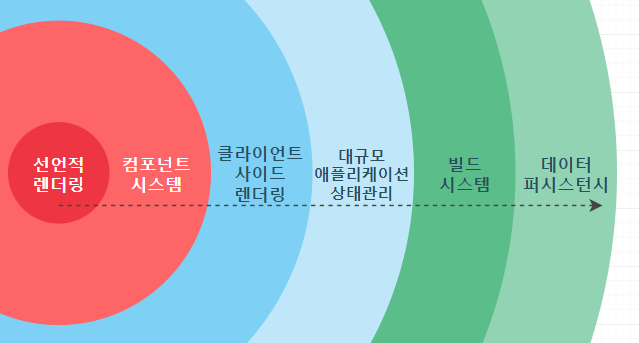
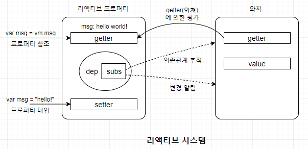
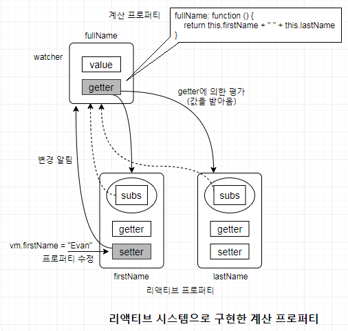
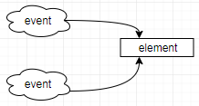
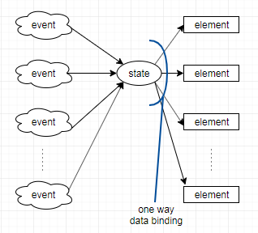

# 렌더링

## 과거방식과 SPA의 구동방식 비교

1. 전통방식

- html link tag의 href를 통해 주소를 바꾸고 해당 리소스를 서버에 요청한다.

- 이때 서버는 html로 화면을 표시하는데 부족함 없는 완전한 리소스를 클라이언트에 응답한다.

- 브라우저는 응답한 html을 수신하고 렌더링 한다.

- 이때 이전 페이지에서 수신된 html로 전환하는 과정에서 전체 페이지를 다시 렌더링하게 되므로

   

  ```
  새로고침
  ```

  이 발생한다.

  ```
  각 페이지 마다 고유 URL이 존재하므로 history관리 및 SEO 대응에 문제가 없다.
  ```

  =>

   

  *BUT*

   

  중복된 리소스를 요청마다 수신해야하며, 전체페이지를 다시 렌더링 하는 과정에서 새로고침이 발생하면서 사용성이 좋지 않다.

1. SPA

- APP에 필요한 리소스 모든 정적 리소스를 최초에 한번 다운로드한다.

- 새로운 페이지 요청 시, 페이지 갱신에 필요한 데이터만 전달받아 갱신한다.

  ```
  전체적인 트래픽 감소, 새로고침이 발생하지 않아 네이티브 앱과 유사한 사용자 경험
  ```

  =>

   

  *BUT*

   

  Link처리에 대한 고민이 필요하다.

  

# Vue.js

## 프로그레시브 프레임워크가 제공하는 단계적 영역



### 1. 선언적 렌더링(declaritive rendering)

선언적 DOM 렌더링과 관련된 영역

HTML 템플릿에 렌더링 대상을 선언적으로 기술해 데이터가 변경될 때마다 DOM을 반응적으로 렌더링하고 사용자 입력 데이터를 동기화할 수 있다.

Vue.js 본체가 제공하는 기능

### 2. 컴포넌트 시스템

UI를 모듈화해 재사용할 수 있게 해주는 영역

Vue.js 본체가 제공하는 기능

### 3. 클라이언트 사이드 라우팅

단일 페이지 애플리케이션이 동작하기 위해 필요한 영역

Vue.js 의 공식 라우팅 라이브러리 Vue Router를 사용해서 단일 페이지 애플리케이션을 만들 수 있다.

### 4. 대규모 상태 관리

컴포넌트 간 상태를 공유하는 방법을 필요로 하는 영역

Vue.js의 공식 데이터플로 아키텍처를 따라 만든 상태 관리 라이브러리인 Vuex를 사용해서 이 영역의 문제를 해결할 수 있다. 기존 컴포넌트를 확장하는 형태로 상태를 중앙에서 관리할 수 있다.

### 5. 빌드 시스템

웹 애플리케이션을 구성하는 컴포넌트 관리, 운영환경 배포, 프로젝트 구성 등과 관련된 영역

Vue.js의 공식 개발 지원 도구를 이용해 이 영역의 문제를 해결할 수 있다. 프로젝트의 환경 구축, 구성 관리에 수고를 들이는 대신 개발에 집중할 수 있다.

### 6. 클라이언트-서버 데이터 퍼시스턴스

웹 애플리케이션의 복잡한 데이터는 클라이언트 사이드와 서버 사이드 양쪽 모두에서 퍼시스턴스 데이터로 유지돼야 한다.

Vue.js 공식 라이브러리가 아직 없어서 서드파티 라이브러리(ex. axios, vue-apollo) 사용자들이 직접 작성한 라이브러리를 사용해 구현한다.


## 기반 기술

### 1. 컴포넌트 시스템

단일 파일에 HTML과 유사한 방식으로 컴포넌트를 작성할 수 있다. 이 파일은 .vue 라는 독자적인 확장자를 사용한다.(이 파일을 번들링 도구와 컴파일러를 사용해 Vue.js 컴포넌트로 등록할 수 있도록 객체로 변환해야 한다.)


파일 하나에 컴포넌트의 모든 요소를 함께 담을수 있는 장점이 있다.

HTML/CSS/자바스크립트 3가지 요소를 하나의 파일로 합쳐 컴포넌트로 분리할 수 있다.

### 2. 리액티브 시스템

Vue.js의 리액티브 시스템은 옵저버 패턴(observer pattern. 상태를 모니터링하는 옵저버와 모니터링 대상으로 구성되며 상태 변화 탐지에 사용되는 패턴)을 기반으로 구현된 것이다.

→ 상태의 변화를 Vue.js가 감지해 자동으로 그 변화를 DOM에 반영하는 구조

리액티브 프로퍼티와 와처(watcher)가 한 쌍을 이뤄 구현된다.





### 3. 렌더링 시스템

Vue.js는 가상 DOM(virtual DOM)을 이용해 DOM을 고속으로 렌더링한다.

가상 DOM(virtual DOM)은 DOM을 간편하고 빠르게 제어하기 위한 기술이다. 더 편리하고 빠르게 다룰 수 있는 DOM 구조의 대체물을 만든 다음, 이 대체물을 조작하고 그 결과를 실제 DOM에 반영한다.

다른 라이브러리나 프레임워크의 가상 DOM과 다른점

- 템플릿이 HTML과 유사해서 개발이 쉽다.
- 최적화가 잘 돼 있어 빠른 렌더링이 가능하다.


## Vue cli

환경 구축 도구


## 	data-binding

### 		1. one-way binding

자바스크립트문에서 vue 인스턴스를 생성해주고 데이터를 바인딩시켜준다.

- html

```html
<!DOCTYPE html>
<html>
<head>
  <meta charset="utf-8">
  <meta name="viewport" content="width=device-width">
  <title>JS Bin</title>
</head>
<body>
  
  <div id="app">
    <h1>hello, I'm {{name}}</h1>
  </div>
  
  <script src="https://cdn.jsdelivr.net/npm/vue/dist/vue.js"></script>
</body>
</html>
```


- js

```js
var app = new Vue({
  el: '#app', 
  data: {
    name: "funny coding",
  },
  // app 뷰 인스턴스를 위한 메소드들
  methods: {
  }
});
```


## Vue.js 기본 사용법

### UI 구성 요소

- **데이터**
- 데이터를 화면에 표시하는 **뷰**
- 사용자가 데이터를 수정하는 **액션**

가장 먼저 애플리케이션이 다루게 될 데이터를 정의한다.

그리고 데이터를 뷰에 어떻게 나타낼 것인지를 설명한다.

마지막으로 사용자 액션을 받는 방법을 설명한다.

### Vue.js 기능들

- 데이터
- 디렉티브
- 템플릿 문법
- 메서드
- 필터
- 생애주기 훅
- 계싼 프로퍼티
- 이벤트 핸들링

### 기존 UI개발의 문제점

jQuery로 UI 개발할 때는 버튼 등 DOM 요소에 이벤트가 발생할 때 호출되는 함수(이벤트 리스너)를 등록하고 이 함수가 자신 및 다른 DOM 요소를 조작하는 방식으로 동적인 UI를 구현한다.



event와 element의 수가 많아질수록, DOM과 event의 연결이 지나치게 복잡해질 것이다.

예를 들어 UI를 업데이트 할 때 특정 DOM 요소를 제외해야 할 경우를 생각해 보자. 각 이벤트 리스너에서 해당 DOM 요소를 참조하는 처리를 하나하나 골라가며 제외하지 않으면 안 된다. 이 과정은 너무 복잡하다.

반대로 DOM 요소를 추가해야 하는 경우에도 각 이벤트 리스너에 해당 DOM 요소에 대한 처리를 일일이 추가해야 한다.

애플리케이션의 규모가 커질수록 유지 보수가 어려워지며 확장성에도 문제가 발생한다.

### Vue.js를 이용한 UI 개발

Vue.js는 다음과 같이 이벤트와 요소 사이에 UI state가 끼어드는 형태이다.



jQuery를 사용하면 이벤트가 발생했을 때 요소를 어떻게 수정할지를 이벤트와 요소의 조합마다 정의해야 했다. 이런 경우 이벤트와 요소의 수가 늘어날수록 정의가 복잡해진다. 이에 비해 Vue.js를 사용하면 이벤트는 UI state를 수정하고, 수정된 UI state에 따라 DOM 트리/DOM 요소가 수정되는 두 가지 과정으로 나눠 단순화 할 수 있다.

jQuery나 DOM API를 사용해서 UI를 개발하면 UI의 상태가 DOM 트리 및 DOM 요소에 위치하게 되는 문제가 생긴다. 이러면 DOM 트리 구조의 변경으로 인해 원래대로라면 DOM 트리 및 DOM 요소와 관계가 없는 UI 상태를 다루는 로직이 영향을 받게 된다.

Vue.js 를 사용하면 UI 상태를 DOM 트리나 DOM 요소와 완전히 분리해 자바스크립트 객체 형태로 유지하면서 앞 장에서 설명한 리액티브 단방향 데이터 바인딩을 이용해 UI 상태의 변화에 맞춰 요소를 자동으로 업데이트하는 방법으로 이 문제를 해결한다.

|                     | jQuery                                                       | Vue.js                                                       |
| ------------------- | ------------------------------------------------------------ | ------------------------------------------------------------ |
| UI 개발의<br />중심 | DOM 트리 중심<br />UI의 상태정보는 DOM 트리가 갖고 있음<br />이벤트에 의해 DOM 트리를 수정 | UI state를 유지하는 자바스크립트 객체<br />1. UI state가 어떻게 자바스크립트 객체로 어떻게 나타낼 것인가.<br />2. 데이터 바인딩으로 UI state와 DOM 트리를 어떻게 매핑시킬 것인가.<br />3. 이벤트를 사용해 어떤 state를 변화시킬 것인가. |

### Vue 객체

#### 생성자

객체를 생성하는 함수를 말한다. new 연산자를 사용해야 한다.

이렇게 생선된 객체를 Vue 인스턴스라고 한다.

```js
var vm = new Vue({
    // .....
})
```

생성자에 옵션 객체를 인자로 전달하는데, 여기엔 여러 옵션이 들어갈 수 있다.

| 옵션 이름 | 내용                         |
| --------- | ---------------------------- |
| data      | UI 상태/데이터               |
| el        | Vue 인스턴스가 마운트된 요소 |
| filters   | 데이터를 문자열로 포매팅     |
| methods   | 이벤트 발생 시의 동작        |
| computed  | 데이터로부터 파생되는 값     |

Vue 인스턴스를 변수(위의 vm)에 대입한 이유는 여러 인스턴스끼리 서로 커뮤니케이션해야할 때 필요하기 때문이다.

#### 컴포넌트

Vue 객체의 component 메서드로 애플리케이션 전체에서 사용하는 컴포넌트를 등록할 수 있다.

또 Vue 인스턴스를 생성할 때 옵션의 components 프로퍼티에서 해당 Vue 인스턴스의 템플릿으로도 컴포넌트를 등록할 수 있다.


### Vue 인스턴스 마운트하기

#### 1. Vue 인스턴스의 적용(el)

옵션 객체의 el 프로퍼티로 지정한 DOM 요소가 마운트 대상이다. el 프로퍼티의 값은 DOM 요소의 객체(document.getElementById, document.querySelector 같은 API를 사용해 받아온 객체)나 CSS 셀렉터 문자열(#app, .app 클래스같이 일치하는 요소가 여러개인 경우 가장 먼저 나오는 것에 적용)로 지정할 수 있다.

```js
var vm = new Vue({
    el: "#app",
    // ...
})
```

#### 2. 메서드를 이용한 마운트($mount 메서드)

메서드를 호출하는 방법으로도 Vue 인스턴스를 마운트할 수 있다. el 프로퍼티를 정의하는 대신 $mount 메서드를 사용하면 된다.

마운트 대상 DOM 요소가 UI 조작이나 통신 등을 통해 지연적으로 추가되는 경우, 요소가 추가되기를 기다려 마운트해야 하므로 이런 방법을 사용한다.

```JS
var vm = new Vue({
    // ...
}).$mount("#app");
```


### UI 데이터 정의(data)

UI의 state가 되는 데이터 객체. data 프로퍼티의 값은 Vue.js의 리액티브 시스템에 포함된다. data 프로퍼티의 값이 변경될 때마다 Vue.js가 이를 자동으로 탐지해 표시 내용이 바뀌는 등의 처리를 수행한다. Vue 인스턴스를 생성할 때 data 프로퍼티를 전달하고 이를 이용해 템플릿의 내용을 출력하는 것이 Vue.js로 화면의 내용을 출력하는 기본 방법이다.

#### $watch를 이용한 모니터링

```js
let items = [
    {
        name: "사또밥",
        price: 1000,
        quantity: 3
    },
    {
        name: "새우깡",
        price: 700,
        quantity: 5
    },
    {
        name: "버터링",
        price: 2200,
        quantity: 4
    }
];
let app = new Vue({
    el: "#app",
    data: {
        items: items
    },

})
app.$watch(function (){
    return this.items[0].quantity;
}, (quantity)=>{
    console.log(quantity)
})
```

```html
<div id="app">
        <ol>
            <li v-for="e in items">품목 : {{ e.name }} <br>가격 : {{ e.price }}<br>수량 : {{ e.quantity }}</li>
        </ol>
    </div>
```


### 템플릿 문법

템플릿은 Vue 인스턴스의 데이터와 뷰(DOM 트리)의 관계를 선언적으로 정의하는 역할을 한다(= 데이터가 있다면 뷰의 내용이 결정된다).

앞에서 데이터를 수정하면 자동으로 뷰도 수정된 것 처럼 데이터의 변경에 따라 뷰를 업데이트 해주는 기능을 **데이터 바인딩**이라고 한다.

Vue.js 템플릿 문법에서 중요한 것은 다음 2가지 개념이다.

#### 1. Mustache 문법을 이용한 데이터 전개

데이터를 HTML 텍스트 콘텐츠로 전개하는 것. 자바 스크립트 객체에 든 데이터를 템플릿 안에 적용해 텍스트 콘텐츠를 만들 때 사용.

data 등의 자바스크립트 객체는 텍스트 콘텐츠 외에도 디렉티브 속성값 등으로도 사용한다.

`<span v-show="isTrue">{{ message }}</span>`

##### 1) 텍스트로 전개하기

{{ }} 사이에서 data 프로퍼티에 정의한 데이터나 계산 프로퍼티, 메서드, 필터를 참조할 수 있다.

```html
<p>
    {{ items[0].name }}: {{ items[0].price }} x {{ items[0].quantity }}
</p>
```

데이터가 변경되면 자동으로 뷰를 다시 렌더링 하거나 DOM을 업데이트한다. 데이터를 뷰에 반영하는 일은 Vue.js가 대신 해준다.

##### 2) 속성값 전개하기

텍스트 외에 DOM 요소의 속성에도 값을 전개할 수 있다. 속성에 값을 전개하려면 Mustache 문법 대신 Vue.js가 제공하는 디렉티브인 v-bind를 사용한다.

`v-bind:속성명="데이터를 전개한 속성값"`	형태로 사용한다.

마우스 오버했을 때 메세지가 나타나도록 title 속성에 data 프로퍼티 값을 지정해보고 data 프로퍼티 값에 따라 버튼을 활성/비활성화 시켜보자.

```html
<button id="btn" v-bind:title="message" v-bind:disabled="!canBuy">
    구매하기
</button>
<script>
	var vm = new Vue({
        el: "#btn",
        data: {
            message: "로그인 후에 구매가 가능합니다.",
            canBuy: true
        }
    })
</script>
```

여기서 주의할 점은 태그의 속성의 값이 true/false로 전환되는게 아니라, 아예 태그의 속성 자체가 추가/삭제되는 원리이다.

#### 2. Directive(지시문)

Directive란?

- HTML 속성 값을 이용해 문법을 확장
- Vue 의 기능들을 사용하기 위해서 사용하는, HTML 태그 안에 들어가는 하나의 속성
- v-`something` 의 형식으로 사용한다.
- 13개의 종류가 있다.
  1. v-text
  2. v-html
  3. v-show
  4. v-if
  5. v-else
  6. v-else-if
  7. v-pre
  8. v-cloak
  9. v-once


##### 1. v-text

```html
<div id="app">
    <h1>
    	Hello, I'm {{ name }}
	</h1>
</div>
```

위의 one-way binding을 directive로 같은 기능을 구현해보자.

```html
<div id="app">
    <h1>
        Hello, I'm <span v-text="name"></span>
    </h1>
</div>
```

v-text를 사용하면 태그의 inner text값이 덮어쓰기 된다.

```js
var app = new Vue({
  el: '#app', // 어떤 엘리먼트에 적용을 할 지 정합니다
  // data 는 해당 뷰에서 사용할 정보를 지닙니다
  data: {
    name: '<i>이탈릭</i>'
  }   
});
```

v-text의 경우 data에 태그를 넣어줘도 text로 인식을 한다.

보안적으로 사용할 수도 있다. (XSS 방지)


##### 2. v-html

data 안에 html 태그를 사용하고 싶을 때 v-text대신 사용할 수 있다.

```html
<div id="app">
    <h1>
        <!-- 이제 태그가 적용이 된다. -->
        Hello, I'm <span v-html="name"></span>
    </h1>
</div>
```

React의 `dangerouslySetInnerHTML` 과 비슷하다.

이 디렉티브를 사용할 땐 악성코드 필터링에 주의하자.


##### 3. v-show

해당 엘리먼트를 display 할지, 말지 true/false로 지정할 수 있다.

먼저, 자바스크립트문에 v-show 디렉티브에 사용할 데이터를 설정해주자.

```js
var app = new Vue({
    el: "#app",
    data: {
        name: "<u>funny coding</u>",
        visibility: true
    }
});
```

```html
<div id="app">
    <h1>
        <!-- 이제 태그가 적용이 된다. -->
        Hello, I'm <span v-show="visibility" v-html="name"></span>
    </h1>
</div>
```

이제 app.visibility를 true로 해주면 출력되고 false로 해주면 숨겨진다.


##### 4. v-if

조건문을 사용하여 엘리멘트가 출력될지 말지 설정할 수 있다. 위의 v-show 디렉티브와 비슷하다.

```js
var app = new Vue({
    el: "#app",
    data: {
        name: "3보다 값이 큽니다.",
        visibility: true,
        value: 0
    }
});
```

```html
<div id="app">
    <h1>
        <!-- 이제 태그가 적용이 된다. -->
        Hello, I'm <span v-if="value>3" v-html="name"></span>
    </h1>
</div>
```

v-if 디렉티브 안의 조건문이 만족되는 경우에만 출력이 되는 걸 확인할 수 있다.


##### 5. v-else

v-if 디렉티브와 함께 사용하며 v-if의 조건을 만족하지 않을 경우 다른 내용을 출력하기 위한 디렉티브이다.

```html
<div id="app">
    <h1>
        <!-- 이제 태그가 적용이 된다. -->
        Hello, I'm <span v-if="value>3" v-html="name"></span>
        <span v-else>value가 3이하네요</span>
    </h1>
</div>
```


##### 6. v-else-if

v-if 디렉터리의 조건을 만족하지 않을 때 체크 할 다른 조건을 설정해줄 수 있다.

v-if와 v-else 사이에 사용되어야 하며 여러번 사용될 수 있다.

```html
<div id="app">
    <h1>
        <!-- 이제 태그가 적용이 된다. -->
        Hello, I'm <span v-if="value>3" v-html="name"></span>
        <span v-else-if="value>0">3보단 작지만 0보단 크네요</span>
        <span v-else>value가 3이하네요</span>
    </h1>
</div>
```


##### 7. v-pre

해당 엘리멘트는 디렉티브가 없다고 알리는 특수한 디렉티브이다.

디렉티브가 필요없는 엘리멘트에게 v-pre를 사용하면 vue 시스템이 엘리멘트가 디렉티브가 없다고 인식하기 때문에 그 엘리멘트 내부의 자식 엘리멘트들을 무시하고 건너뜀으로서 컴파일 속도가 빨라진다.

```html
<div id="app">
    <h1>
        <!-- 이제 태그가 적용이 된다. -->
        Hello, I'm <span v-if="value>3" v-html="name"></span>
        <span v-else-if="value>0">3보단 작지만 0보단 크네요</span>
        <span v-else>value가 3이하네요</span>
        <span v-pre>{{ 그대로 컴파일 해주세요 }}</span>
    </h1>
</div>
```


##### 8. v-cloak

우리가 웹 페이지를 로드할 때 자바스크립트 코드가 실행되기까지의 시간이 필요하다. 자바스크립트 코드가 실행되기 전까지는 숨기고 싶은 내용들도 모두 출력 될 수 있는데, 이를 막기 위해 v-cloak 디렉티브를 사용한다.

즉, Vue 인스턴스가 제대로 준비될 때 까지 우리의 템플렛을 위한 html 코드를 숨기고 싶을 때 이 디렉티브를 사용한다.

숨기고 싶은 태그에 v-cloak를 넣어주자.

```html
<div id="app" v-cloak>
    <h1>
        <!-- 이제 태그가 적용이 된다. -->
        Hello, I'm <span v-if="value>3" v-html="name"></span>
        <span v-else-if="value>0">3보단 작지만 0보단 크네요</span>
        <span v-else>value가 3이하네요</span>
        <span v-pre>{{ 그대로 컴파일 해주세요 }}</span>
    </h1>
</div>
```

그 다음 css 를 지정해주어야 한다.

```css
[v-cloak]{
    display: none;
}
```


##### 9. v-once

해당 엘레멘트를 초기에 **딱 한번만 렌더링**한다. 즉, 자바스크립트 데이터를 사용하는 엘레멘트중 변동이 없거나 초기값만 보여주고 싶은 경우 사용하면 된다.

```html
<div id="app" v-cloak>
    <h1 v-once v-if="value > 5">value 가 5보다 크군요</h1>
    <h1 v-else-if="value === 5">값이 5네요</h1>
    <h1 v-else>value 가  5보다 작아요</h1>.
    <h1 v-pre>{{ 이건 그대로 렌더링해줘요 }}</h1>
    
    <h2 v-once>초기 값: {{ value }}</h2>
	<h2>현재 값: {{ value }}</h2>
</div>
```


##### 10. v-bind

html 태그 안의 내용을 설정하고 싶은 경우 위의 방법들로 설정해주면 된다.

하지만 img 태그의 src 같이 태그의 속성을 바꾸고 싶을 때는 v-bind 디렉티브를 사용해야 설정이 가능하다.

- javascript

```js
// 새로운 뷰를 정의합니다
var app = new Vue({
  el: '#app', // 어떤 엘리먼트에 적용을 할 지 정합니다
  // data 는 해당 뷰에서 사용할 정보를 지닙니다
  data: {
    name: 'Vue',
    feelsgood: 'https://imgh.us/feelsgood_1.jpg'
  }   
});
```

- html

```html
<div id="app">
    <h1>Hello, {{ name }}</h1>
    
</div>
```

조금 더 간단하게 쓰기 위하여 v-bind도 생략시켜 줄 수 있다.

```html
<div id="app">
    <h1>Hello, {{ name }}</h1>
    
</div>
```

머스태쉬 {{ }} 나, 디렉티브를 사용할 때 내부값을 꼭 뷰 인스턴스의 데이터 명으로 해야되는건 아니다. 이 안에도 자바스크립트 표현식을 사용할 수 있다.

예를들어, v-bind 디렉티브에 자바스크립트 표현식을 써보자.

- js

```js
// 새로운 뷰를 정의합니다
var app = new Vue({
  el: '#app', // 어떤 엘리먼트에 적용을 할 지 정합니다
  // data 는 해당 뷰에서 사용할 정보를 지닙니다
  data: {
      name: 'Vue',
      feelsgoodman: 'https://mmorpg.net/wp-content/uploads/2018/11/feelsgoodman-300x273.png',
      feelsbadman: 'https://2static.fjcdn.com/pictures/Feels_9c41c0_6042240.jpg'
  }   
});
```

- html

```html
<div id="app">
    <h1>Hello, {{ name }}</h1>
    
    <h1>
        {{ Date() }}
    </h1>
</div>
```


##### 11. v-for

html에서 for-loop를 구현하기 위해서 사용한다. ex) 게시판의 게시물 목록 렌더링

이 디렉티브를 반복할 태그에서 `item in items`의 형식으로 작성한다.

- item : 이것은 별칭이기 때문에 편의상 item이라 명명한 것이지 우리 마음대로 설정해도 된다.
- items : Vue 인스턴스 안에 있는 데이터 이름이다.

예를들어, Todolist를 만든다고 생각해보자.

- js

```js
var app = new Vue({
  el: '#app', 
  data: {
    todos: [
      { text: 'Vue.js 튜토리얼 작성하기' },
      { text: 'Webpack2 알아보기' },
      { text: '사이드 프로젝트 진행하기' }
    ]
  }   
});
```

- html

```html
  <div id="app">
    <h2>오늘 할 일</h2>
    <ul>
      <li v-for="todo in todos">{{ todo.text }}</li>
    </ul>
  </div>
```

- html (index를 사용하고 싶은 경우)

```html
  <div id="app">
    <h2>오늘 할 일</h2>
    <ul>
      <li v-for="(e, i) in todos">{{i}} : {{ todo.text }}</li>
    </ul>
  </div>
```

forEach를 사용한다고 생각하면 된다.


##### 12. v-model

이전에 머스태쉬 {{ }} 를 사용한 데이터 출력은, 단방향 데이터 바인딩 이었다.

- 단방향 데이터 바인딩 : 데이터 → 뷰
- 데이터 값이 변하면 바로 업데이트가 된다.

이를 양방향 데이터 바인딩으로 바꿔서 데이터가 뷰를 바꿀 뿐 아니라 뷰의 값이 바뀔 때 데이터 값도 바뀔 수 있도록 해보자.

- html

```html
<div id="app">
    <h1>Hello, {{ name }}</h1>
    <input type="text" v-model="name"/>
</div>
```

- js

```js
var app = new Vue({
  el: '#app', 
  data: {
    name: "<u>funny coding</u>",
    text: "아직 없음"
  },
  // app 뷰 인스턴스를 위한 메소드들
  methods: {
  }
});
```

이 디렉티브를 체크박스와 연동해서 토글 기능도 만들 수 있다.

- html

```html
<div id="app">
    <h1>Hello, {{ name }}</h1>
    <input type="text" v-model="name"/>
    <input type="checkbox" v-model="check"/>
    <h1 v-text="check? '있었는데?':'없었습니다.'"></h1>
</div>
```

- js

```js
var app = new Vue({
  el: '#app', 
  data: {
      name: "<u>funny coding</u>",
      text: "아직 없음",
      check: true
  },
  // app 뷰 인스턴스를 위한 메소드들
  methods: {
  }
});
```

이렇게 v-model을 사용하면 양방향 데이터 바인딩이 가능하지만, 이것만으론 부족하다. 프로젝트를 완벽하게 만들기 위해선 이벤트를 다뤄줄 디렉티브 v-on이 필요하다.


##### 13. v-on

드디어 methods를 사용할 때가 되었다. v-on을 사용해서 이벤트를 발생시 처리를 할 수 있는데, 그 동작을 정의하기 위해 methods를 정의해서 사용하자.

v-on을 사용할 때는 `v-on:이벤트이름="메소드이름"` 형식으로 사용해보자.

카운터를 만들면서 사용법을 익혀보자.

- js

```js
let app = new Vue({
    el: "#app",
    data: {
        count: 0
    },
    methods: {
        plus: ()=>{
            this.count++;
        },
        minus: ()=>{
            this.count--;
        }
    }
})
```

- html

```html
<div id="app">
    <h1>
        초기 숫자 : <span v-once v-text="count"></span>
        현재의 숫자 : {{ count }}
        차이는 알아서 계산하세요
    </h1>
    <button v-on:click="plus">
        플러스
    </button>
    <button v-on:click="minus">
        마이너스
    </button>
</div>
```

